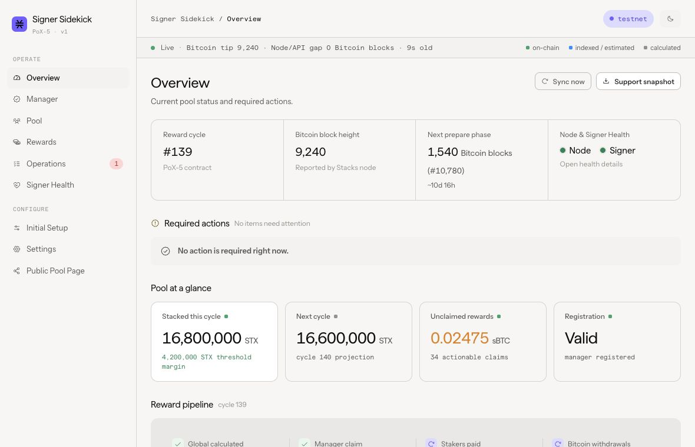

# Signer Sidekick

Signer Sidekick is the stateful operations companion for a running Stacks PoX-5 signer and STX
pool. It continuously reconciles registration, pool membership, rewards, withdrawals, and
signer/network health from the operator's node and indexed chain sources.

V1 provides monitoring, externally signed manager administration, and Observe reward claims.
Assist is a separate, controlled release track; it is not available for unattended mainnet use.



## Documentation

Start with [the documentation index](docs/README.md). Use
[Zero to Signing](https://stx.fan/zero_to/signing/) for first-time signer-manager setup and
[stacksup](https://github.com/stx-labs/stacksup) for node and signer infrastructure. Sidekick begins
with a configured manager principal after those day-zero steps.

## Scope

- One network and signer-manager per deployment. Pools may include PoX-5 bond participants;
  Sidekick observes bond membership and claims per-bond reward buckets, but never creates or
  changes a bond.
- A configured, deployed signer manager and its recurring operator lifecycle.
- Browser-wallet or manual execution for signer registration/rotation, manager administration, and
  Observe reward claims.
- Hiro or self-hosted Stacks API endpoints.
- No custody of signer or manager-admin private keys.
- No end-user wallet connection or stake submission.
- Node and signer signals that explain signing readiness and help distinguish a local operator fault
  from a network-wide condition. General host and daemon lifecycle management remain out of scope.
- No bond creation, Bitcoin L1 lock handling, SPV proofs, early exits, or rollovers.

Any interface-compatible manager can use the detected baseline administration and registration
actions. Optional capabilities are enabled only when Sidekick can prove their reviewed interface;
Assist has additional release gates.

## Development

Requires Node.js 24.18.0 and pnpm 10.32.1.

```sh
pnpm install
pnpm check
pnpm test:coverage
pnpm test:regtest
pnpm build
```

See [development](docs/operator/development.md) for browser tests, the released Devnet harness,
live-node smoke tests, and upstream-source verification.

## Repository

| Path | Purpose |
| --- | --- |
| `apps/sidekick` | API, CLI, reconciliation, persistence, and dashboard host |
| `apps/dashboard` | React operator UI |
| `packages/protocol` | PoX-5 and signer-manager codecs, profiles, and artifacts |
| `packages/api-contracts` | Versioned operator API schemas and browser-facing DTOs |
| `contracts` | Pinned upstream sources and generated test artifacts |
| `test` | Contract, browser, container, and released-Devnet validation |
| `design` | Vendored tokens, fonts, and the local UI contract |

## License

GPL-3.0-only. Vendored sources retain their notices; see
[contract provenance](contracts/PROVENANCE.md) and [NOTICE.md](NOTICE.md).
