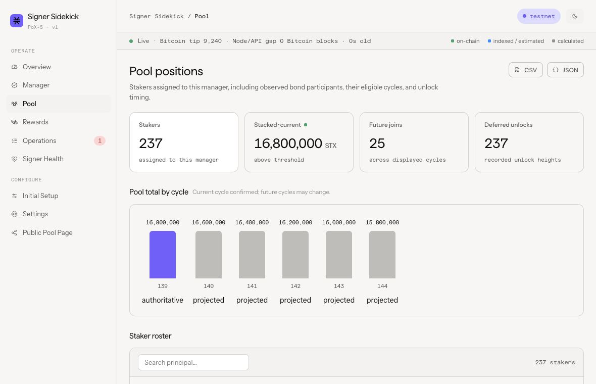

# Documentation

Choose the shortest path for your task.

| Audience | Start here | Use it for |
| --- | --- | --- |
| Mainnet operator | [Container deployment](operator/deployment.md) | Install, configure, upgrade, restore, diagnose |
| Node/signer operator | [Node and signer requirements](operator/node-signer-requirements.md) | Configure and automatically verify Sidekick-specific node, signer, monitoring, and event endpoints |
| PoX-5 Testnet evaluator | [PoX-5 Testnet runbook](operator/pox5-testnet-deployment.md) | Exercise recurring signer and pool operations on the dedicated PoX-5 network |
| Contributor | [Development](operator/development.md) | Build, test, and run locally |
| Product and architecture reviewer | [Scope reset plan](product/scope-reset-plan-2026-08-13.md) | Proposed operator-only boundary, event reconciliation, and rewards roadmap |
| Scope-reset implementer | [Implementation plan](product/scope-reset-implementation-plan-2026-08-13.md) | Milestone boundary, ordered slices, invariants, and validation gates |
| First-run implementer | [First-run connection contract](product/first-run-connection-2026-08-13.md) | Connection gate, exact operator language, recovery states, and database identity binding |
| Data recovery implementer | [Fresh-install data recovery](product/fresh-install-data-recovery-2026-08-15.md) | Current-state authority, roster proof, member-scoped history, coverage, and backpressure |
| Activity/action implementer | [Activity and action workspace contract](product/activity-and-action-workspace-2026-08-14.md) | Frozen navigation, unified activity projection, contextual actions, routes, and acceptance contract |
| Overview implementer | [Overview attention model](product/overview-attention-model-2026-08-14.md) | Operator attention policy, root-cause suppression, domain summaries, freshness, and migration contract |
| Operation adapter reviewer | [Recurring operation contracts](product/recurring-operation-contracts-2026-08-13.md) | Retained actions, authority, safety inputs, and completion evidence |
| Contract compatibility reviewer | [Deployed signer-manager baseline](reviews/deployed-signer-manager-baseline-2026-08-13.md) | Mainnet contract families, universal PoX-5 baseline, and capability-adapter policy |
| Signer-health model reviewer | [Diagnosis model](product/signer-health-diagnosis-model.md) | Evidence hierarchy, attribution logic, external-reference boundary, and calibration process |
| Signer-health implementer | [Signer Health](product/signer-health.md) | Implemented monitoring sources, thresholds, retention, and API behavior |
| Assist reviewer | [Transaction engine safety contract](architecture/transaction-engine.md) | Authority and execution invariants before reviewing Assist |

## Dashboard

Representative fixture data showing a large pool's cycle projection and staker roster.

## Source of truth

- Runtime configuration: [mainnet](../.env.mainnet.example),
  [PoX-5 Testnet](../.env.pox5-testnet.example), `apps/sidekick/src/config.ts`, and
  `apps/sidekick/src/transaction-engine/runtime-config.ts`.
- CLI commands: `node apps/sidekick/dist/main.js help` after building.
- HTTP behavior: route schemas and tests under `apps/sidekick/src`.
- Database structure: migrations and repositories under `apps/sidekick/src/storage`.
- Protocol inputs: [contract provenance](../contracts/PROVENANCE.md).
- First-time signer-manager setup: [Zero to Signing](https://stx.fan/zero_to/signing/).
- Node and signer lifecycle direction: [stacksup](https://github.com/stx-labs/stacksup).

Documentation explains intent, safety boundaries, and operator procedures. It does not duplicate
code-level schemas, command inventories, or upstream node/signer setup.

## Architecture and design

The [architecture index](architecture/README.md) covers cross-cutting decisions that are hard to
infer from code. The [design contract](../design/README.md) defines local UI rules; React code and
browser tests define component behavior.
