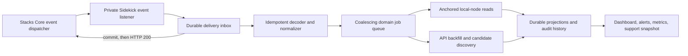

# Signer Sidekick scope reset

- Status: Proposed
- Date: 2026-08-13
- Scope: Product boundary, target architecture, and implementation sequence

## Decision summary

Signer Sidekick should become the stateful operations companion for one running, registered PoX-5
signer and its signer-manager. It continuously reconciles the operator's on-chain and signer
reality, preserves an auditable history, explains what changed, identifies what needs attention,
and safely prepares the recurring operations of running a signer or pool.

It should not deploy a signer-manager, install or manage node/signer infrastructure, or host a
staker-facing application:

- [stx.fan Zero to Signing](https://stx.fan/zero_to/signing/) provides the general, one-time,
  wallet-signed path from no manager to a registered and staked signer.
- [StacksUp](https://github.com/stx-labs/stacksup) owns service installation, configuration,
  lifecycle, chainstate, logs, and commands that must execute inside a node or signer container.
- Sidekick owns durable PoX-5/operator state, manager-capability operations, rewards, alerts,
  protocol-level signer health, transaction evidence, and the support snapshot.

Sidekick must not require a recognized signer-manager source version before it can attach, observe,
or explain the operator's core PoX-5 state. The manager trait standardizes only `validate-stake!`,
so broader operations cannot be inferred safely from trait compliance alone. Sidekick should expose
a manager-neutral PoX-5 baseline for every attached manager and add normalized manager interactions
only when runtime capabilities satisfy a reviewed behavioral adapter. Executable adapter admission
requires the deployed source to match an immutable source fingerprint reviewed for that capability;
this is an execution gate, not a manager-version, attachment, or observation gate. Contract
source/structure hashes and deployment provenance remain diagnostic evidence for every manager.

The initial mainnet contract census and the proposed compatibility layers are documented in
[Deployed signer-manager baseline](../reviews/deployed-signer-manager-baseline-2026-08-13.md).

The target is **event-driven but not event-trusting**. Stacks Core callbacks should make Sidekick
react promptly even when no browser is open. A callback is a trigger and a piece of evidence, not
the final authority: Sidekick still proves current state with anchored local-node reads and retains
periodic reconciliation and API backfill for gaps and reorgs.

Issue [#31](https://github.com/stx-labs/signer-sidekick/issues/31) is core to this scope. The Rewards
experience should show the next distribution checkpoint, the exact currently accrued global reward
balance, a clearly labelled estimate of the pool's share and operator fee, and the action that will
be required when calculation or claims become available.

Assist remains a future execution mode, not the product definition. The useful product exists in
Observe with wallet-signed operations; Assist may later automate the same reviewed plans after its
release gates are met.

## Product test

“Does it need memory?” is a useful first test, but it is not sufficient by itself. Use this routing
order for a proposed feature:

1. Does it create, configure, upgrade, restart, back up, or inspect a daemon/container? It belongs
   in StacksUp.
2. Is it a general one-shot wallet flow that can be safely reconstructed from current public chain
   state, with no operator history? It belongs in a stx.fan dApp.
3. Does it need operator-specific durable state, reconciliation, provenance, alerting, recurring
   scheduling, transaction ambiguity handling, signer diagnosis, or a contract-capability safety
   policy? It belongs in Sidekick.
4. Is it a public surface for a staker rather than the operator? It does not belong in Sidekick.

This deliberately leaves some superficially stateless actions in Sidekick. Updating a manager fee
or submitting a reward claim can be performed by a static dApp, but Sidekick is the primary path
when it can bind the action to reconciled state, preview exact bytes and post-conditions, record the
result, and warn about races. The static dApp is the break-glass fallback.

## Operator jobs to be done

An operator should be able to answer these questions without assembling contract calls or opening
several monitoring products:

- Is the network operating and signing normally, and are my node, signer, manager registration,
  signer grant, and current/next-cycle eligibility okay?
- If signing is unhealthy, is the evidence most consistent with my node, my signer, a source/API
  problem, a network-wide problem, or not enough evidence yet?
- What changed since I last looked, what evidence supports it, and is any source stale?
- Who is in my pool now and in future cycles, including STX-only and Bitcoin-bond participants, and
  which joins, exits, or unlocks need attention?
- What rewards are accruing, when is the next calculation, what is my pool likely to receive, and
  what fees am I likely to earn?
- Which operation is due now, what will it do, who must sign it, and did it reach canonical finality?
- If something goes wrong, can I export one redacted record that lets Stacks Labs reconstruct the
  node, signer, Sidekick, chain-source, and transaction state?

The Overview should answer “what needs attention now?” Other pages should explain and operate one
domain, rather than repeat broad status summaries. The normative inclusion, priority,
root-cause-suppression, freshness, and page-composition rules are defined in the
[Overview attention model](overview-attention-model-2026-08-14.md).

## Product boundaries

### In scope

- One network, signer, and signer-manager per Sidekick deployment.
- Durable manager, signer, pool, rewards, transaction, and protocol-health observations.
- A manager-neutral PoX-5 baseline for every attached contract that satisfies the network's
  signer-manager trait, without a recognized-source or recognized-version requirement.
- Runtime ABI/source inspection, capability reporting, and normalized interactions through
  reviewed capability adapters. Unknown custom features remain visible as custom contract activity
  but do not acquire executable behavior automatically.
- Local-node-first current state with explicit provenance and domain-specific freshness.
- Indexed roster and historical-event discovery, followed by local-node verification wherever the
  protocol exposes a read-only proof.
- Current and future pool membership, threshold, prepare-window, and unlock visibility for both
  STX-only positions and the STX side of Bitcoin bonds.
- Reward calculation state, accrual, projections, manager fees, staker claims, withdrawals, and
  permissionless calculation readiness.
- Ongoing signer registration or key rotation and any manager administration, fee, withdrawal,
  claim, payout, or recovery operation whose detected capability has a reviewed adapter.
- Wallet-signed transaction plans with deterministic bytes, post-conditions, anchored preflight,
  durable observation, ambiguity handling, and audit history.
- Signer-protocol health based on node RPC, signer monitoring, calibrated metrics, and independent
  network-reference evidence sufficient to distinguish likely local faults from network-wide
  conditions without overstating certainty.
- Actionable alerts and a comprehensive redacted support snapshot.
- Observe as the default mode; Assist only through the existing explicit release gates.

### Out of scope

- Fresh signer-manager deployment or first-time staking.
- Public pool pages, public wallet connections, or staker transaction submission.
- Node, signer, Bitcoin, API, database, Docker, systemd, or host lifecycle management.
- Host CPU, memory, disk, logs, backups, or general observability.
- Signer private keys, manager-admin private keys, wallet custody, or a Docker socket.
- Bond creation, Bitcoin L1 lock creation, SPV proof submission, early exits, or rollovers.
- Specialized support for arbitrary custom manager features outside the common capability baseline.
- Contract-source or contract-version allowlists that block otherwise provable baseline behavior.
- Multi-tenant or hosted control-plane behavior.

### The first-run experience after removing setup

“Sets nothing up” must not mean a blank or cryptic first launch, but Sidekick must not replace the
removed setup workflow with another wizard. The approved screen flow, gate, language, recovery
states, data-loading boundary, and database-identity behavior are normative in the
[First-run connection contract](first-run-connection-2026-08-13.md).

In summary:

- Deployment configuration supplies the network, local node, optional API/telemetry sources, and
  required signer-manager principal. Sidekick does not offer an in-app principal picker.
- First launch performs a bounded, read-only local-node connection assessment. It never deploys,
  registers, stakes, imports setup state, or waits for indexed history and full projections.
- Connection means only that Sidekick can prove the intended local chain, PoX-5 contract, deployed
  manager, and exact signer-manager trait. Registration, eligibility, data coverage, signing
  health, and per-action availability remain independent dimensions.
- A successful connection opens Overview immediately. Missing registration/grant, optional API or
  telemetry, threshold, eligibility, and manager-action adapters appear as focused operational
  states rather than a global setup or attachment failure.
- A missing deployed manager points to Zero to Signing; a wrong network or trait-incompatible
  contract points to configuration/contract selection. Recheck repeats reads, while environment
  changes require a restart.
- The first useful screen identifies the registered and runtime signer keys separately, shows
  registration/current-next-cycle eligibility, reports both participant types, and names every
  diagnostic-source gap without inferring that a registered signer is actively signing.
- Ongoing registration repair and signer-key rotation remain recurring Manager operations.
  Sidekick validates the public grant output and prepares the wallet call; StacksUp or the upstream
  signer CLI generates the signature on the signer host.
- The first successful connection durably binds the database to the network and manager principal.
  A later mismatch enters read-only diagnostic safe mode instead of mixing histories or silently
  rebinding.

Zero to Signing is a preferred external handoff rather than a Sidekick-owned service or release
dependency. Its maintainers own day-zero wallet-flow availability and support. Sidekick's support
boundary begins after a trait-compatible manager exists; Sidekick keeps a maintained upstream or
manual setup fallback, centralizes the external URL so it can change, and gates removal of its old
setup surface on a tested trait-compatible handoff plus that fallback—not on ownership of the
external dApp.

### Signer and network health boundary

Sidekick does not run the signer, but it must understand the parts of signer operation that change
whether this operator can participate, earn, or safely act. Persist enough evidence to answer:

- **Identity and eligibility:** Is the runtime signer reachable and using the public key that PoX-5
  has granted and registered for this manager? Is it in the current or next signer set with the
  expected weight?
- **Chain progression:** Are the local Stacks and Bitcoin tips advancing, is the signer observing
  the same cycle/tenure context, and does local progression materially disagree with independent
  network references?
- **Signing participation:** Is the signer receiving proposals it is expected to see, producing
  responses on time, and seeing those responses accepted? What rejection, timeout, or missed
  participation reasons are actually evidenced?
- **Comparative diagnosis:** Do connected peers or independent chain-progression references show
  the same failure pattern, or is the anomaly confined to the operator's node, signer, or data
  source? Detailed signer-cohort exploration belongs in [Slotwatch](https://slotwatch.dev/), not
  Sidekick's normal collection path.
- **Recovery evidence:** What changed, when did the problem start, which sources were available,
  and what bounded redacted evidence should Stacks Labs receive?

Findings must name both evidence and uncertainty. Classify them as `likely-local-node`,
`likely-local-signer`, `source-disagreement`, `suspected-network-wide`, or
`insufficient-evidence`; never turn one unavailable API or one silent metric into a network-wide
claim. Keep raw and rolled-up history long enough to compare the incident window with prior healthy
behavior. The implemented metrics, windows, thresholds, evidence rules, and support seam are
normative in [Signer Health v2](signer-health.md), with the authority and attribution rules defined
in the [Signer Health diagnosis model](signer-health-diagnosis-model.md); changing them requires a
model revision and fresh calibration evidence.

Host CPU, disk, process lifecycle, Docker/systemd management, and unrestricted log collection stay
in StacksUp or the operator's observability stack. Sidekick consumes documented node/signer
endpoints and includes correlation windows and public configuration in its support snapshot.

### Bond participant boundary

Sidekick does not create or manage Bitcoin bonds, but the signer-manager baseline is incomplete if
it ignores their Stacks side. Use PoX-5 state such as `get-bond-membership`, signer delegation/share
reads, staker state, and reward buckets to include:

- STX-only participants and their eligible cycles/unlocks;
- bond participants, their STX amount, bond membership/index, applicable cycles, and contribution
  to signer weight and reward calculations; and
- the complete ordered active-bond input required to explain or prepare `calculate-rewards`.

The UI and support snapshot should distinguish the two position types without suggesting that
Sidekick controls the Bitcoin lock, SPV proof, rollover, or exit lifecycle.

## Event-driven reconciliation

### Why events are the right direction

The current implementation already has durable chain events, cursors, normalized manager activity,
30-second current-state refreshes, five-minute manager-history backfills, and 30-minute roster
reconciliation. It is not dependent on an open browser, but its anti-entropy paths remain
timer-driven and the manager event stream is pulled from the Stacks API.
This creates avoidable delay and makes “current” behavior depend too much on indexer availability.

Stacks Core's
[event dispatcher](https://github.com/stacks-network/stacks-core/blob/master/docs/event-dispatcher.md)
can deliver burn blocks and selected contract print events directly to an observer. That is the
right low-latency input for a local operator companion.

### Authority model

Use a three-layer model:

1. **Observer delivery:** evidence that the local node saw something and a prompt to reconcile.
2. **Observer-claimed event:** an idempotent decoded claim tied to a transaction, event index,
   block, source, delivery, and verification state. It is not yet a durable chain fact.
3. **Node-verified event and domain projection:** promote the event only after an anchored local-node
   read confirms the referenced canonical transaction/block and relevant event; rebuild current
   operator state at that anchor.

The local Stacks node is authoritative for current PoX-5 and manager reads. The API discovers
historical events and roster candidates; it does not overrule a healthy local node. An external
reference API is an independent health signal, not an authority gate.

Indexer lag should degrade only the domains that require the indexer. It must not block the whole
application. For example, Sidekick can show current node/signer/reward-cycle health while labelling
the roster and historical activity as last verified at an older anchor. A high-risk transaction
plan may still block if its complete input set depends on stale indexed discovery.

### Initial subscriptions

The node or StacksUp owns the event-observer configuration. Sidekick exposes a private listener and
documents the required configuration; it never edits the node configuration itself.

Start with:

- `burn_blocks`, to advance the cycle clock, reward outlook, readiness deadlines, and fallback
  reconciliation schedule;
- `<configured-pox-5-contract>::print`, to observe calculation, staking, registration, grant, and
  bond events relevant to operator state; and
- `<configured-manager>::print`, to observe the attached contract's administration, claims,
  payouts, withdrawals, and custom activity without assuming one event vocabulary.

Do not subscribe to every event by default. Add block-proposal or StackerDB streams to Signer Health
only after issue [#19](https://github.com/stx-labs/signer-sidekick/issues/19) establishes stable,
actionable interpretations. The first implementation should continue using signer/node metrics for
proposal health.

An illustrative operator-owned node configuration is:

```toml
[[events_observer]]
endpoint = "sidekick-events:3700"
events_keys = [
  "burn_blocks",
  "SP000000000000000000002Q6VF78.pox-5::print",
  "<configured-manager-principal>::print",
]
timeout_ms = 5000
disable_retries = false

[node]
event_dispatcher_blocking = false
event_dispatcher_queue_size = 1000
```

The shipped example must render the actual network and attached-contract principals rather than ask
operators to copy this block literally.

### Ingestion and processing design



The listener should:

- run on a separate private port or network interface from the operator API;
- accept only the documented callback paths and bounded JSON bodies;
- persist the delivery and content hash in SQLite before returning HTTP 200;
- return quickly and perform decoding and chain reads asynchronously;
- deduplicate at-least-once delivery by chain identity, endpoint kind, transaction/event index, and
  block identity;
- persist decoded callbacks initially as `observer-claimed`; promote them to permanent
  `node-verified` facts only after anchored local-node confirmation, and quarantine or expire
  unverifiable claims with an explicit reason;
- coalesce bursts into one pending job per domain and highest observed anchor;
- retain node-verified relevant events permanently and raw deliveries/unverified claims only for a
  bounded support window;
- expose queue depth, last accepted delivery, processing lag, duplicates, decode failures, retries,
  and last reconciled anchor as metrics and support data.

Stacks Core retries non-200 deliveries and can retain pending payloads. A slow synchronous handler
therefore risks coupling Sidekick latency to the node dispatcher. Returning 200 before the local
database commit would create the opposite failure: a callback could be acknowledged and lost.

### Reorgs, gaps, and recovery

- Treat deliveries as at-least-once and potentially out of order.
- Repeated burn-block notifications are normal around PoX forks and must be idempotent.
- Never infer canonicality solely from arrival order.
- On startup, process the durable inbox, compare the last observer anchor with the local tip, and
  schedule a catch-up reconciliation.
- Keep the existing API manager-log cursor and periodic backfill. It supplies history from before
  the observer was configured and detects missing or noncanonical events.
- Periodically perform a full domain reconciliation even when events are flowing. Events reduce
  latency; they do not replace anti-entropy.
- If the observer is silent while the local burn height advances, raise an observer-degraded
  finding and fall back to timer-driven reconciliation without blocking node-first current state.

### Freshness targets

There should not be one refresh period. A five-second target Stacks block time calls for separate
latency budgets by source and cost; these are product targets, not chain-finality claims:

| Domain | Normal fast path | Target / fallback |
| --- | --- | --- |
| Relevant chain state | Stacks Core callback, followed by anchored node reads | Durable callback acknowledgement under 1 second where practical; affected cheap projections p95 within 2 seconds and normally before the next Stacks block (5 seconds) |
| Signer liveness and proposal participation | Lightweight signer/node monitoring reads | Sample every 5 seconds; require persistence or multiple observations before paging on a transient condition |
| Open dashboard | Server-pushed cached-state invalidation | Immediate after projection commit; visibility-aware 15-second cached-state polling when push is unavailable |
| Observer and tip gap detection | Compare observer cursor, local node tip, and signer samples | Every 15 seconds; degrade to polling when callbacks are silent |
| Small local current-state anti-entropy | Anchored local-node reconciliation | Every 30 seconds, coalesced with event work |
| Indexed history and roster | Relevant PoX/manager events trigger targeted discovery and verification | Five-minute history backfill and 30-minute full-roster baseline |
| Reward accrual | Burn-block and calculation events | Event driven; no five-second reward poll because the underlying accrual changes on Bitcoin/reward events |

The five-second signer sample is deliberately cheap and local; it must not perform full manager,
roster, API, or reward reconciliation. Alert evaluation may use a longer window even though evidence
is sampled every five seconds. Show freshness independently for node state, roster, manager
activity, reward outlook, and signer health. One stale indexer-derived domain must not turn the
entire application into “loading.”

## Reward outlook for issue #31

### What Sidekick can state exactly

At one local-node anchor, Sidekick can show:

- the current burn height and distribution half-cycle;
- the next burn height at which `calculate-rewards` becomes available;
- the calculation height represented by that call (`eligible burn height - 1`);
- blocks remaining and an ETA from the existing recent Bitcoin block-time sample;
- the PoX-5 `get-new-rewards` value, which is the exact global sBTC reward balance received since
  the last calculation;
- the last completed calculation height and whether calculation is pending, completed, ahead, or
  unknown;
- the pool's current STX and bond shares, global share denominators, current manager fee, and any
  already-snapshotted cycle fee; and
- already earned, claimable, reserved, or withdrawal-liability balances.

The UI must call `get-new-rewards` **accrued globally**, not claimable and not the pool's reward.
Nothing becomes claimable until the permissionless global calculation runs.

### What must be an estimate

Add a contract-exact integer simulator for the next PoX-5 calculation. It should use the active
ordered bond list, bond target rates, reserve cut, global shares, manager shares, and the same
rounding order as the contract. Generate its golden vectors by executing the real vendored PoX-5
contract in Clarinet simnet over synthetic bond/share states; do not hand-author expected vectors
from the duplicate implementation. From that model, show:

- **Pool share if calculated with current accrued rewards** — a present-state estimate assuming the
  currently observed shares and bond set remain applicable at the checkpoint.
- **Projected pool reward at the checkpoint** — a run-rate projection using durable observations of
  `get-new-rewards` within the current distribution interval.
- **Projected operator fee** — a contract-aligned per-staker estimate using the currently configured
  fee, clearly stating that the actual fee is pinned only when the manager first claims a bucket.

Do not present a forecast until there are enough in-interval samples. Start with a range rather than
false precision, record the sample window and assumptions, and compare every projection with the
eventual `calculate-rewards` result so the model can be calibrated. If the roster, bond list, or
share denominators cannot be proven at the selected anchor, show the exact global accrual and omit
the pool/fee estimate.

Suggested API shape:

```ts
interface RewardOutlook {
  anchor: ChainAnchor;
  nextCalculation: {
    eligibleBurnHeight: number;
    calculationBurnHeight: number;
    blocksRemaining: number;
    estimatedAt: string | null;
  };
  accrued: {
    globalSats: string;
    source: "pox5-get-new-rewards";
  };
  poolEstimate: null | {
    ifCalculatedNowGrossSats: string;
    projectedGrossSats: { low: string; point: string; high: string };
    projectedOperatorFeeSats: { low: string; point: string; high: string };
    configuredFeeBips: string;
    assumptions: string[];
    sampleBlocks: number;
    confidence: "low" | "developing" | "calibrated";
  };
  calculation: RewardCalculationStatus;
  observedAt: string;
}
```

Persist reward-outlook observations by distribution cycle and anchor. Burn-block and PoX-5 print
events trigger a new observation; the periodic anti-entropy loop fills gaps. A successful
`calculate-rewards` event records the realized distribution and closes the projection interval.

### Product presentation

Overview should show only:

- “Next reward calculation: block X, about Y”;
- “Global rewards accrued: Z sBTC”; and
- “Estimated pool / operator fee: A / B,” with an estimate badge and a link to assumptions.

Rewards should show the interval timeline, exact accrual, projected range, current share inputs,
actual prior distributions, model error, fee assumptions, and the next required action. Prefer a
small trend or range chart over a large dashboard card.

When calculation becomes available but has not run, create a specific action. In Observe, Sidekick
should prepare and track a wallet-signed permissionless `calculate-rewards` transaction using the
complete ordered active-bond list. Whether and when Assist may submit it automatically remains part
of [#17](https://github.com/stx-labs/signer-sidekick/issues/17), including fallback delay and race
policy.

## Target information architecture

Reduce the navigation to operator work:

The navigation is frozen at exactly six pages: Overview, Pool, Rewards, Activity, Signer Health,
and Settings. Manager and Operations are removed once their retained actions and history are
reachable through the replacement surfaces. Their old dashboard URLs are deleted rather than
redirected. Contextual operations use a shared non-navigation action workspace. The normative
routes, grouping, statuses, and execution flow are defined in the
[Activity and action workspace contract](activity-and-action-workspace-2026-08-14.md).
Overview is a server-owned decision projection over those domain contracts, not a browser-composed
alert feed; its normative behavior is defined in the
[Overview attention model](overview-attention-model-2026-08-14.md).

| Page | Primary question | Contents |
| --- | --- | --- |
| Overview | What needs attention now? | Current cycle, required actions, eligibility, next reward calculation, concise network/node/signer diagnosis |
| Pool | Who is participating and what changes next? | STX-only and bond positions, current/future totals, joins, exits, unlocks, roster freshness |
| Rewards | What has accrued and what can or must happen? | Outlook, calculation state, claims, fees, withdrawals, realized history |
| Activity | What happened, what is still happening, and did it finalize? | Active work, verified manager/PoX events, grouped transaction plans/outcomes, corrections, and audit trail |
| Signer Health | Is signing healthy, and is a problem local or network-wide? | Network references, node/signer observations, participation history, calibrated findings, source coverage and uncertainty |
| Settings | What is this Sidekick attached to? | Endpoints, manager capabilities/provenance, auth, observer status, support snapshot |

Manager actions are contextual actions from Overview, Rewards, Pool, or the compact manager section
in Settings. A notice links directly to its shared action workspace or exact Activity detail; the
operator never has to visit an intermediate page to act. Keep advanced administration discoverable
without making it the product's center. Operations and manager activity converge into Activity;
the current Operations page mixes transaction engine status, alerts, and chain-data counts that
belong on Overview, Activity, or Settings.

Remove Initial Setup and Public Pool Page from navigation. Do not replace them with marketing pages;
use one clear external link only when the operator has not attached a manager.

## Current implementation assessment

### Keep and strengthen

| Current area | Assessment | Direction |
| --- | --- | --- |
| Canonical chain anchors and node-first reads | Correct foundation | Land the node-first work, retain stable-read checks, and make freshness domain-specific |
| SQLite chain events, cursors, roster evidence, longitudinal observations | Directly aligned | Extend with observer inbox, reward outlook, projection versions, and durable health/action history |
| Manager event normalization and API backfill | Useful but currently assumes a narrow manager vocabulary | Keep as history/backfill; add node callbacks, generic custom-event capture, and capability-specific normalizers |
| Pool reconciliation and cycle forecast | Core product | Trigger targeted refreshes from events and preserve 30-minute anti-entropy |
| Reward status, buckets, claims, fees, and withdrawals | Core product | Add accrual/outlook and make calculation a first-class recurring operation |
| Manager administration wallet intents | Core only for detected, reviewed capabilities | Extract from onboarding, split by capability, and keep exact-signature, byte, post-condition, and audit safeguards |
| Transaction engine and observation | Core product | Present as Activity/actions; keep Observe primary and Assist separately gated |
| Signer Health | Correct boundary but too narrow without attribution | Calibrate findings, persist useful history, compare independent network evidence, and avoid host-monitoring expansion |
| Support bundle | Core operator-support feature | Add observer, capability, network-comparison, domain freshness, projection, reconciliation, and action state |
| Background refresh loops | Important fallback | Keep anti-entropy; events become the fast path, not a replacement |

### Refactor before deleting setup

| Current area | Problem | Required extraction |
| --- | --- | --- |
| `onboarding-wallet-intent.ts` | Setup deployment and recurring manager actions share a very large module | Move manager administration, registration/key rotation, and generic wallet-intent lifecycle into domain modules before deleting Fresh actions |
| `setup-status.ts` / setup snapshot fields | The name implies onboarding, but much of the data is ongoing readiness | Rename/recast as manager and operation readiness; retain registration, grant, eligibility, and prepare-window checks |
| `server.ts` | Route registration spans setup, actions, snapshots, health, and support in one large file | Split route plugins by status, pool, rewards, activity/actions, health, settings, and observer ingress |
| `operator-service.ts` | A single refresh path couples domains with different authorities and costs | Introduce independently fresh projections and typed coalescing jobs |
| dashboard `main.tsx` | Navigation, auth, polling, onboarding, and page loading are intertwined | Remove onboarding state and isolate shell/auth/refresh responsibilities |

### Replace manager-version gates

The present implementation spreads manager-profile assumptions across observation, UI, setup, and
transaction code. The scope reset must change these intentionally rather than merely rename
“profile” to “capability”:

| Current area | Current coupling | Target |
| --- | --- | --- |
| `manager-verification.ts`, `manager-trust.ts`, and `manager-profile-store.ts` | Source/profile recognition is part of broad manager verification and trust tiering | Split trait verification, provenance evidence, runtime capability discovery, and code-owned behavioral adapters into separate results |
| `operator-service.ts` and dashboard manager-action availability | An unrecognized profile can create a global `manager:unsupported` finding or broad action block | Always render the universal baseline; report unavailable actions individually with the missing capability/invariant |
| setup/activation and manager pages | Compatibility is presented mainly as profile/source matching | Replace setup-era profile UI with attached principal, trait result, discovered capabilities, external dependencies, source provenance, and custom-function evidence |
| reference claim observer/wallet-intent services | Claim plans bind to a named reference profile and recognition tier | Bind plans to a versioned capability adapter, exact detected function/response semantics, observed immutable source fingerprint, complete anchored inputs, and post-state contract; the fingerprint records what was reviewed rather than selecting a product version |
| ADRs 0006/0007 and transaction-engine docs | Installed profiles and release compatibility describe the current security boundary | Supersede them with the layered compatibility model and preserve the rule that editable data cannot grant executable authority |

Do not discard source fingerprints from transaction records: they are valuable evidence that the
reviewed code and planned code were the same immutable deployment. Remove their use as a predefined
product-version allowlist or as a gate on unrelated baseline features.

### Remove

- Fresh manager preparation, runtime manager render/download, deployment, first-time grant, initial
  registration, and setup progress/wizard state.
- Initial Setup page and Fresh/Attach activation plans. Replace Attach with a read-only configured
  manager connection check.
- Public Pool Page/enrollment UI, pool-card artifact generation, and public enrollment examples.
- Setup-specific aliases, routes, schemas, CLI commands, persistence, and tests after shared manager
  actions have moved.
- Setup notices and “finish Initial Setup” global gates. Replace them with domain-specific readiness
  and a direct Zero to Signing link only when no manager is attached.

The setup-specific files account for well over ten thousand source and test lines before shared-code
extraction; the net deletion will be smaller because manager actions, wallet-intent observation,
manager verification, and readiness checks remain valuable.

### Branch-landing concerns to resolve

The node-first branch is the right substrate, but scope-reset work should not preserve its current
rough edges by accident:

- API lag may not block node-derived domains, but indexed-only domains need a bounded and visible
  freshness policy. “Use stale forever” is not graceful degradation.
- High-risk wallet intents must retain stability checks and every witness needed to prove their
  complete inputs. Removing a global API-equality gate must not become a node-tip race.
- A 15-second browser interval should read cached Sidekick state and pause/back off when hidden or
  failing; it must not force a full upstream sync.
- Split the large server and onboarding modules as part of the boundary extraction, not as an
  unrelated rewrite.

## External dependency decisions

### Signer-manager compatibility

The initial deployment supplement found 47 canonical contracts matching the PoX-5 signer-manager
trait, ten byte-distinct sources, and roughly six meaningful behavior families. The authoritative
census population must start from PoX-5 registration and current/next signer-set state; trait-based
deployment discovery then finds historical, unused, and not-yet-registered contracts. The trait
itself guarantees only `validate-stake!`; it does not standardize administration, fees, rewards,
payouts, withdrawal liabilities, or event payloads. The detailed evidence and family comparison are in
[Deployed signer-manager baseline](../reviews/deployed-signer-manager-baseline-2026-08-13.md).

Use four compatibility layers:

1. **Universal PoX-5 observation:** registration, grant, signer-set membership, eligibility,
   weight, STX-only and bond participation, cycle timing, and reward state keyed by the attached
   manager. This never depends on a known manager source.
2. **Runtime capability discovery:** read the deployed ABI and source, identify exact callable
   signatures and referenced contracts, inventory print events, and report recognized and custom
   capabilities. Discovery grants no transaction authority.
3. **Reviewed capability adapters:** normalize one behavior such as reference-family fee updates,
   aggregate-recipient claims, or max500 payouts. Each adapter owns exact arguments and response
   semantics, anchored inputs, wallet-intent construction, post-conditions, expected events,
   post-state verification, fixtures, and an immutable set of source fingerprints reviewed for that
   capability. An exact source match admits only that capability's execution; it does not establish
   product-wide compatibility or select a named manager version.
4. **Custom extensions:** preserve generic source, ABI, event, and transaction evidence, but leave
   custom product semantics to operator-specific tooling unless a reusable capability is reviewed
   into core.

Source and structure hashes remain useful for detecting changes, reproducing support cases, and
selecting known test vectors. They must not block attach or the universal baseline and must not, by
themselves, enable an executable action. An ABI name match alone is also insufficient for a
money-moving operation because identical names can implement different authorization, accounting,
recipient, and return-value semantics.

Setup removal therefore does not depend on choosing one canonical manager contract. It depends on
an end-to-end handoff test proving that any trait-compliant deployed manager attaches to Sidekick's
baseline. Zero to Signing should display a manager's capabilities to the user, but Sidekick remains
responsible for discovering them again from chain state.

### StacksUp seam

Agree the boundary before its open signer issues become duplicate protocol implementations:

| StacksUp issue | Ownership recommendation |
| --- | --- |
| [#5 signer status](https://github.com/stx-labs/stacksup/issues/5) | StacksUp reports process/container/endpoints/versions and links to Sidekick. Sidekick owns registration, grant, signer-set, weight, rewards, and prepare-window state. |
| [#6 signer grant](https://github.com/stx-labs/stacksup/issues/6) | StacksUp owns executing `stacks-signer generate-staking-signature` where the key lives. Sidekick owns verification, durable ceremony state, and the manager wallet intent for rotation/repair. |
| [#7 verify key](https://github.com/stx-labs/stacksup/issues/7) | StacksUp exposes the key the running signer is using; Sidekick compares runtime identity with the on-chain grant and registration. |
| [#8 calculate rewards](https://github.com/stx-labs/stacksup/issues/8) | Move to Sidekick. It is a PoX-5 business operation requiring bond enumeration, anchored state, scheduling, transaction observation, and audit history. |

StacksUp should render the event-observer configuration and verify that the callback is flowing. It
should not parse PoX-5 operator state. Sidekick should accept normal endpoints and never require
StacksUp to be installed.

This is a directional ownership seam, not yet the supported operator path. StacksUp currently has
no release and its signer-key handling is unfinished; Sidekick documentation must continue to point
to shipped upstream/manual procedures until StacksUp publishes and validates those capabilities.

## Issue disposition

Do not treat open issues as canonical, but make their ownership explicit:

| Issue | Recommendation |
| --- | --- |
| [#31 rewards visibility](https://github.com/stx-labs/signer-sidekick/issues/31) | Keep and expand into the reward-outlook work described here |
| [#20 bond Observe](https://github.com/stx-labs/signer-sidekick/issues/20) | Complete the remaining Devnet sBTC-bond scenario, then close |
| [#19 signer health calibration](https://github.com/stx-labs/signer-sidekick/issues/19) | Keep; use it to decide which protocol observations become actionable findings |
| [#18 public pool page](https://github.com/stx-labs/signer-sidekick/issues/18) | Move to the maintained stx.fan/dApp experience, link the destination, then close in Sidekick |
| [#8 node and signer setup](https://github.com/stx-labs/signer-sidekick/issues/8) | Close as superseded by StacksUp and upstream deployment guidance |
| [#17 Assist questions](https://github.com/stx-labs/signer-sidekick/issues/17) | Keep as protocol/research dependencies for unattended execution |
| [#6 Assist release](https://github.com/stx-labs/signer-sidekick/issues/6) | Keep as the release gate; make it depend on resolved #17 questions and the post-reset action engine |

Create separate implementation issues for deployed-manager baseline/capability adapters, observer
ingestion, domain projections/freshness, network-versus-local diagnosis, reward outlook, setup
removal, information architecture, support handoff, and the StacksUp seam.

## Implementation sequence

The executable slice plan, file-level starting points, and validation gates are maintained in the
[scope-reset implementation plan](scope-reset-implementation-plan-2026-08-13.md).

Dependency order matters, and the milestone boundary must remain explicit. The setup-removal reset
is expected to shrink and simplify the shipping product; the complete roadmap will probably grow
the codebase because it adds event ingestion, capability adapters, reward simulation, and durable
diagnosis. That is acceptable only when each addition consolidates authority and replaces weaker or
duplicated behavior.

The **scope-reset milestone** consists of the node-first foundation, manager-neutral attachment,
recurring-operation extraction, setup/public-surface deletion, and documentation replacement.
Completing every manager adapter, event subsystem, reward projection, or enhanced health finding is
**V2 roadmap work** and must not creep into the deletion milestone.

### 1. Establish the compatibility baseline and external seams

- Build the census from PoX-5 registered signers and current/next signer sets, then supplement it
  with trait-matching deployments and observed activity so unused/test deployments are not mistaken
  for production families or allowed to distort adapter priority.
- Produce structural and behavioral diffs, transaction/event samples, golden fixtures, and a
  machine-readable capability registry. The registry describes tested behavior; it is not an
  attach allowlist.
- Implement the universal PoX-5 capability first, including STX-only and bond positions, then add
  reviewed adapters for reusable manager behaviors in priority order by active deployment usage.
- Record the StacksUp/Sidekick command, health, event-observer, and support-bundle seams in both
  repositories.

Only a successful trait-compliant handoff should block setup deletion. Event, health, reward, and
universal-baseline work can proceed in parallel; no custom manager receives money-moving behavior
merely because it was discovered by the census.

### 2. Land and harden the node-first foundation

- Rebase the current branch onto main and resolve the API-freshness, high-risk witness, and polling
  concerns above.
- Confirm current-state pages remain usable when the local node is healthy and the API is behind or
  unavailable.
- Confirm roster/history and transaction planning fail closed only when their own required evidence
  is missing.
- Preserve background snapshot/roster refresh, support-bundle coverage, and responsive UI work.

### 3. Extract recurring operations, then remove setup

- Split wallet-intent lifecycle and recurring manager actions out of onboarding modules and behind
  explicit capability adapters.
- Recast setup status as manager/operation readiness.
- Keep signer grant verification and registration/key rotation as ongoing manager repair.
- Remove Fresh setup, activation plans, setup page/routes/state, runtime deployment artifacts, and
  public enrollment/page generation.
- Rewrite README, deployment, testnet, dashboard, and architecture docs around an already-running
  manager.
- Replace the setup Devnet acceptance path with connect, observe, action-plan, and reconciliation
  acceptance, using the configured connection check rather than a setup-era Attach workflow.

### 4. Add the event inbox and domain scheduler

- Add private callback ingress, durable deliveries, idempotency, bounded raw retention, metrics, and
  support-bundle data.
- Add burn-block and PoX-5 print decoders, generic attached-manager event storage, and
  capability-specific manager decoders.
- Route events to independent pool, reward, activity, readiness, and health jobs.
- Keep API backfill and periodic anti-entropy; test callback loss, duplicates, reordering, restart,
  reorg, API outage, and queue pressure.
- Add a StacksUp-rendered example and a generic manual node configuration example.

### 5. Build reward outlook and calculation action

- Add `get-new-rewards`, next-checkpoint/ETA, durable observations, and realized calculation events.
- Implement a source-derived integer simulator whose golden vectors are generated by executing the
  real vendored PoX-5 contract in Clarinet simnet over synthetic states.
- Add projection ranges, sample/confidence gates, per-staker fee rounding, and explicit assumptions.
- Prepare and observe wallet-signed `calculate-rewards`; keep unattended submission behind Assist
  gates.
- Add overview summary, detailed Rewards presentation, and overdue-calculation alert.

### 6. Consolidate the operator experience

- Implement the frozen navigation, server-owned activity projection, and common action workspace
  from the [Activity and action workspace contract](activity-and-action-workspace-2026-08-14.md).
- Replace the hand-built alert feed and duplicated dashboard summaries using the
  [Overview attention model](overview-attention-model-2026-08-14.md).
- Move required actions to Overview and domain pages.
- Merge transaction/activity history and remove the mixed Operations status page.
- Simplify or absorb Manager into contextual actions and Settings.
- Define and persist the minimum signer evidence needed to answer: process reachable, correct key,
  registered/eligible, receiving proposals, responding in time, accepted/rejected, and behaving
  differently from the broader signer set. Use evidence windows and explicit uncertainty.
- Classify findings as likely local node, likely local signer, source disagreement, suspected
  network-wide, or insufficient evidence. A network-wide classification requires more than one
  operator-local source.
- Update the support snapshot to describe each domain's authority, anchor, age, observer state,
  backlog, manager capabilities, network comparisons, signer participation history, projection
  version, and transaction ambiguity without including secrets.
- Define a support handoff seam with StacksUp so infrastructure/log evidence can be correlated by
  time window without making Sidekick a host log collector.

### 7. Re-evaluate Assist on the smaller surface

- Keep the same wallet-signed plan format as the source of truth.
- Re-run independent security review after setup code is gone and event/action boundaries are stable.
- Enable only adapters and operations with explicit attestation, finality, nonce, retry, revocation,
  and incident-response ownership.

## Acceptance criteria

The scope reset is complete when:

- a new Sidekick deployment connects read-only to an existing manager without offering chain setup
  or another wizard;
- any trait-compliant manager receives the universal PoX-5 baseline without a recognized source or
  version, while unavailable actions are reported per capability rather than as global manager
  incompatibility;
- STX-only participants and the STX side of Bitcoin bonds both contribute to pool membership,
  signer weight, rewards, and support evidence;
- setup and public-staker routes, UI, persistence, and runtime artifacts are absent;
- all recurring manager/reward operations that remain are backed by reviewed capability adapters,
  deterministic wallet-signed paths, anchored preflight, and durable outcomes;
- a closed browser does not prevent node, pool, reward, activity, or health state from advancing;
- a relevant node callback normally updates cheap affected state before the next five-second Stacks
  block and meets the two-second p95 projection target under normal load;
- a forged or unverifiable callback can enter only the bounded observer inbox, never the permanent
  activity/audit history or a current-state projection; only anchored node-verified events are
  promoted to durable facts;
- callback loss, duplicate delivery, restart, and reorg converge through anti-entropy;
- a healthy local node remains usable during external API lag, while indexed-only state is visibly
  bounded at its last verified anchor;
- Rewards shows the exact next calculation block/ETA and global accrual, and never labels a forecast
  or pre-calculation balance as claimable;
- pool and fee projections reproduce contract arithmetic, expose assumptions/range, and disappear
  when required evidence is incomplete;
- Zero to Signing's trait-compliant manager handoff passes an end-to-end connection/baseline test
  without a shared manager-profile requirement;
- Sidekick exposes and documents its PoX-5 status, event-observer, grant-verification,
  transaction-planning, and support-artifact seams, and the overlapping StacksUp issues are
  explicitly dispositioned;
- Signer Health can show the evidence behind likely-local, suspected-network, source-disagreement,
  and insufficient-evidence classifications without claiming global network health from one API;
- the support snapshot contains enough redacted evidence to diagnose observer, source, signer,
  manager, pool, rewards, and transaction state; and
- full unit, browser, regtest, Devnet, container, provenance, and support-bundle tests pass on the
  reduced product.

## Measures of success

- Time from relevant chain event to updated Sidekick state.
- Percentage of time each domain is current at a proved anchor.
- Count and age of unresolved operator actions.
- Reward projection error by distribution interval and model version.
- Number of support cases resolved from the first support snapshot without additional data requests.
- Reduction in code and tests tied exclusively to setup/public-staker concerns.
- Zero money-moving plans produced from incomplete, stale, or unverified inputs.

## Open decisions

The manager-version gate, bond-participant coverage, Sidekick's responsibility for
operator-relevant signer diagnosis, network-reference confidence rule, health retention, and
support handoff are no longer open. The remaining decisions are:

1. **Capability-adapter ownership:** executable capability admission requires byte-exact source
   matching to an immutable fingerprint reviewed for that capability, exact-signature matching,
   fixtures, anchored preflight, deterministic post-conditions, expected-event and post-state
   verification, and independent security review for Assist. Decide who approves and versions
   those adapters and reviewed fingerprint sets.
2. **Manager census maintenance:** registration and current/next signer-set state define the primary
   population. Decide the minimum transaction/event sample needed to establish semantics and
   whether the deployment supplement is refreshed on every new trait-matching deployment, on
   release, or on a schedule.
3. **Push transport:** use server-sent events as the default one-way invalidation channel unless
   implementation evidence requires WebSockets; retain visibility-aware 15-second cached-state
   polling as fallback. Confirm proxy timeout/keepalive requirements before committing to SSE.
4. **Indexed and high-risk freshness:** set maximum ages independently for roster/history display
   and each action-planning witness. The proposed 30-minute roster baseline is not permission to
   plan an action from 30-minute-old inputs.
5. **Reward-model confidence:** choose the minimum sample window and realized-error history required
   before a projection advances from low to developing or calibrated confidence.
6. **Permissionless calculation policy:** decide who is expected to call `calculate-rewards` and
   after what grace period the due action becomes an alert or an Assist candidate.
None of these questions changes the core boundary: Sidekick owns durable signer/pool operations,
not setup or infrastructure lifecycle.
