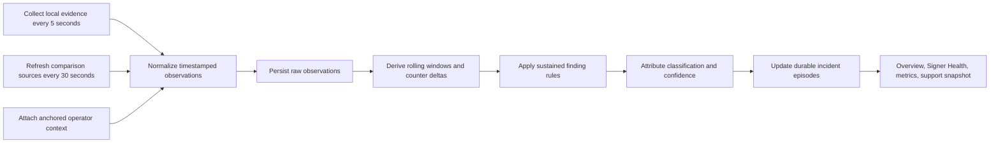

# Signer Health diagnosis model

- Status: Product and implementation contract
- Date: 2026-08-17
- Scope: How Sidekick turns local node, signer, on-chain, and bounded external evidence into an
  operator-facing diagnosis

## Purpose

Signer Health exists to answer one operational question:

> Is my signer operating properly, and when it is not, does the evidence point to my node, my
> signer, a comparison source, a broader network condition, or not enough evidence yet?

The diagnosis is an evidence-backed aid for an operator and the Stacks Labs support team. It is not
a consensus oracle and does not claim certainty that its sources cannot prove. Every non-healthy
finding must say what was observed, for how long, which sources support it, which evidence
contradicts it, and how confident Sidekick is in the attribution.

The implemented sources, thresholds, retention, and API behavior are documented in
[Signer Health v2](signer-health.md). This document explains why those rules exist and how to
review or refine them.

## Product boundary

Sidekick diagnoses the parts of node and signer behavior that directly affect this operator's
ability to participate. It does not:

- install, configure, restart, or repair node or signer infrastructure;
- collect unrestricted service or host logs;
- replace host, container, disk, CPU, memory, or network observability;
- build a network-wide signer explorer or a complete picture of every signer;
- treat one API, peer, metric, or momentary mismatch as global truth; or
- automatically remediate a node, signer, or network condition.

[Slotwatch](https://slotwatch.dev/) is the appropriate detailed view of signer-cohort behavior.
Sidekick may direct an operator there when broader signer context would help investigate an
ambiguous finding, but it does not reproduce that product or depend on it for routine diagnosis.

StacksUp or the operator's infrastructure tooling owns process lifecycle and host diagnosis.
Sidekick's support snapshot provides a correlation window so that infrastructure evidence can be
matched to the protocol-level incident.

## Core principles

### Local state is primary for local diagnosis

The connected Stacks node is authoritative for what this deployment has processed. The local
signer monitoring service is authoritative for what this signer reports receiving, validating, and
sending. Anchored local-node reads are authoritative for the operator's registration and expected
participation.

An external API may corroborate or contradict those sources, but an API does not override an
advancing local node merely because its indexed height differs.

### External references exist only to improve attribution

External references answer narrow comparison questions:

- Is another observed chain source advancing while the local node is stalled?
- Is the local node materially behind the peers it can see?
- Do multiple distinct signals agree that chain progression has stopped?
- Is a public indexer itself stale while the local node remains healthy?
- Do independent sources name different canonical hashes at the same Stacks height?

Sidekick does not collect external signer-cohort data merely because it is available. The current
diagnosis does not require the Hiro Signer Metrics API. If future incident evidence shows that a
bounded cohort comparison would materially change an operator action, that should be proposed as a
separate model revision rather than added as general-purpose monitoring.

### Time and repetition turn observations into actionable findings

A failed request, one slow response, or a temporary height mismatch is an observation. It becomes a
finding that needs operator attention only after meeting a defined sample count and duration. This
reduces false positives from normal five-second block timing, API indexing delay, process
scheduling, and transient network loss. The only single-observation rule records a local canonical
tip regression or same-height hash change as informational reorg evidence; by itself it does not
raise the health state to `needs-attention`.

### Evidence and inference remain separate

“The signer rejected five recent proposals” is evidence. “The signer is broken” is an inference.
Rejections can also reflect invalid miner proposals, node validation, or disagreement about chain
context. Sidekick uses `source-disagreement` when the available evidence cannot safely assign one
cause.

### Uncertainty is an operator result

`insufficient-evidence` and `source-disagreement` are not implementation failures. They are honest
answers when Sidekick can show an anomaly but cannot support a stronger attribution. The UI should
make the next investigation step clear without inventing certainty.

## Evidence hierarchy

| Evidence source | What it can support | Authority and limitations |
| --- | --- | --- |
| Local node `/v2/info` | local network identity, Stacks and Bitcoin tips, sync state | Primary for the local node's processed state; not proof of global network health |
| Local node `/v3/health` | local height versus the most advanced connected peer | Peer-informed comparison reported through the local node; not a census of all peers |
| Local node Prometheus | peer counts and warning/error counter changes | Supporting local evidence; missing release-specific metrics reduce coverage |
| Local signer `/info` | signer key, address, network, version | Primary for the runtime identity the signer reports |
| Local signer `/heartbeat` | whether the signer can reach its configured node | Primary first-person node-connectivity signal from the signer |
| Local signer `/metrics` | node view, reward cycle, proposals, validation, responses, latency, conflicts | Primary for what the signer reports; validation duration is reported by its local node, while response duration remains diagnostic only |
| Anchored operator snapshot | registered signer key, grant, manager, current and next expected participation | Node-proved operator context; determines whether signer observations are relevant to expected participation |
| Hiro reference API | independently indexed Stacks and Bitcoin tip progression | Comparison only; delay or failure is a source condition, not a local failure |
| Separately configured indexed API | a second chain-progression comparison when its origin is distinct | Comparison only; the same origin is not counted twice |

External sources are deduplicated by configured origin. Multiple endpoints on the same origin must
not be counted as independent corroboration merely because their paths differ. A newly configured
comparison origin should be treated as independent only when the operator intends it to represent a
separate chain observer.

## Diagnosis pipeline

### 1. Collect

The server owns collection. It begins with the Sidekick control plane and continues without an open
browser or an operational manager connection. Cheap local endpoints are polled every five seconds;
public and configured comparison APIs are refreshed every 30 seconds. After either API returns a
rate-limit response, reference polling backs off to at least 60 seconds while local collection
continues normally.

When a 30-second reference sample is reused in intervening five-second observations, its original
`checkedAt` remains unchanged. Reuse does not become a new success, failure, or independent sample.

### 2. Normalize and retain

Upstream bodies are converted to bounded typed values. Failures become bounded error codes rather
than raw responses. One malformed historical row is skipped and reported as a data-quality count;
it cannot stop the collector. The store retains raw observations for 72 hours and five-minute
rollups and resolved episodes for 90 days.

Signer counters are cumulative, so Sidekick calculates increases across the relevant window and
handles counter resets as a new epoch. Histogram percentiles are calculated from bucket increases,
not the lifetime cumulative histogram: every bucket is re-baselined together whenever the `+Inf`
total drops (a joint reset), so a mid-window signer restart cannot desynchronize the buckets and
inflate the percentile. The crossing bucket is then linearly interpolated (as Prometheus
`histogram_quantile` does) rather than reported at its upper boundary, so a p95 of 4.8s reads as
`4.8s` instead of rounding up to the enclosing bucket edge.

### 3. Establish expectation

Signer participation findings are interpreted alongside the anchored operator snapshot:

- Is the monitored signer key the one registered on chain?
- Does the signer report the configured network and current reward cycle?
- Is it expected to participate in the current or next cycle?
- Does its node view align with the local node?

Sidekick does not infer operator registration or eligibility from an indexed API when the local node
can prove it.

The last successful anchored operator context is retained separately from dashboard caches for two
minutes. Routine roster or activity reconciliation therefore cannot erase identity or participation
expectations. Once that context is too old, dependent rules become indeterminate; they do not treat
missing evidence as recovery.

### 4. Apply sustained rules

Every actionable finding requires a defined sample count and minimum duration (see "Time and
repetition" above). The informational local-canonical-tip event is the documented exception. The
exact thresholds are the implementation contract and are listed once, in the
[Signer Health v2](signer-health.md) thresholds table; this document does not restate them so the two
cannot drift apart.

These are product thresholds, not protocol constants. They should change only with test fixtures and
real incident/calibration evidence showing that a different boundary improves operator decisions.
The typed source of truth is `apps/sidekick/src/health-monitoring-rules.ts`; it records each rule's
stable identifier, threshold, rationale, and false-positive guard. The evaluator must create a
finding through that catalog, which prevents an undocumented ad hoc condition from opening a
durable incident.

End-to-end response p95 is intentionally not a rule. It remains available in telemetry and support
data, but Stacks Signer derives it from the block header's wall-clock timestamp. It cannot open or
strengthen a Sidekick health finding. Validation p95 is actionable because the local Stacks node
reports `validation_time_ms` for each successful validation response.

### 5. Attribute without overstating

The available classifications are:

- `healthy`: no sustained actionable finding is supported.
- `likely-local-node`: local RPC, peer-gap, sync, local-stall, or node-reported validation evidence
  points to this node.
- `likely-local-signer`: signer reachability, identity, node view, or participation evidence points
  to this signer.
- `source-disagreement`: sources materially disagree, or one signer metric cannot safely identify
  whether the cause is local, a proposal, or broader network context.
- `suspected-network-wide`: the local tip is stalled and at least two distinct peer/reference
  signals corroborate the same lack of progress.
- `insufficient-evidence`: Sidekick lacks the samples, baseline, or source coverage needed for a
  stronger result.

The word `likely` and the phrase `suspected-network-wide` are deliberate. Sidekick provides a
diagnostic inference, not an absolute root-cause determination.

### 6. Select the primary diagnosis

Several findings may be active at once. Sidekick first keeps only the highest active severity for
primary-diagnosis selection, then uses this precedence within that severity:

1. `likely-local-node`
2. `likely-local-signer`
3. `suspected-network-wide`
4. `source-disagreement`
5. `insufficient-evidence`

This prevents an informational local-node observation from hiding a critical signer failure while
still preferring an actionable local root cause among findings of equal severity. The complete
finding list remains visible, including supporting, contradicting, and unavailable evidence.

### 7. Preserve recovery evidence

The first qualifying observation opens a durable finding episode. Repeated observations update the
same episode. Only fresh contradictory or recovered evidence resolves it; a missing source retains
the episode without inventing another occurrence. A Sidekick restart hydrates recent observations,
active episode identifiers, and counter baselines and holds resolution during a 15-minute warm-up.
Support-bundle export reads stored evidence and never collects or reconciles health state.

## Decision examples

| Observed evidence | Classification | Reasoning |
| --- | --- | --- |
| Local node is at least 3 blocks behind its most advanced connected peer for 25 seconds | `likely-local-node` | The node's own peer view shows a sustained local gap |
| Local node has not advanced for 90 seconds while Hiro or a connected peer advances | `likely-local-node` | Independent progress contradicts the local stall |
| Local node advances while an indexed API remains at least 3 blocks behind for 90 seconds | `source-disagreement` | The comparison source is stale; it cannot make the healthy local node unhealthy |
| Local node and at least two distinct peer/reference signals remain stalled for 180 seconds | `suspected-network-wide` | Multiple signals support a broader progression problem, while the wording preserves uncertainty |
| Signer heartbeat fails for 10 seconds across 3 checks | `likely-local-signer` | The signer itself reports that it cannot reach its node |
| Signer receives proposals but accumulates at least 3 missing responses | `likely-local-signer` | First-person signer counters show an actionable local participation gap |
| Signer is expected in the current set, the local node advances at least 12 times over 10 minutes, and the proposal counter does not move | `likely-local-signer` | Anchored expectation plus first-person silence identifies a local participation failure |
| Local node height regresses or its canonical hash changes at the same height | `source-disagreement` | Sidekick records a possible reorg for correlation without treating it as an outage |
| Local node and an indexed source repeatedly name different hashes at the same height | `source-disagreement` | Sustained canonical disagreement is stronger than an ordinary indexing-height delay |
| Signer has a high rejection rate but node and chain progression remain normal | `source-disagreement` | Rejections alone do not distinguish local validation from a bad proposal or chain-view disagreement |
| Signer monitoring is unconfigured or the initial baseline is incomplete | `insufficient-evidence` | Sidekick cannot make a stronger signer claim without the missing evidence |

## External-reference boundary

The normal diagnosis path requires no detailed view of other signers. Chain progression already
provides the bounded external evidence needed to distinguish the common operator cases:

- If the local node stalls while peers or an indexed source advance, the problem is likely local.
- If the local node advances while an API lags, the API is stale.
- If local and multiple independent signals stall together, a broader network problem is plausible.
- If this signer receives proposals but does not respond, its own monitoring is sufficient to flag
  the local participation problem.

Detailed cohort behavior may explain an ambiguous rejection or conflict, but it is not required to
identify the operator's immediate action. The current model preserves that ambiguity as
`source-disagreement` and lets an operator use Slotwatch or contact Stacks Labs for deeper network
context.

Do not add the Hiro Signer Metrics API to the mandatory collection loop, settings, durable health
model, or dashboard without evidence that it materially improves a recurring local diagnosis. A
future narrow, incident-triggered comparison may be considered if all of the following are true:

1. repeated real incidents remain ambiguous under the current evidence model;
2. external signer context changes the recommended operator action;
3. the comparison can be anchored to the same finalized proposal or block;
4. public API delay and failure cannot create or strengthen a local finding; and
5. the feature remains a diagnosis aid rather than a signer explorer.

## Relationship to operator actions

Health findings explain what needs investigation; they do not directly restart services or submit
transactions. A finding may link to the relevant Sidekick page, the support snapshot, Slotwatch, or
the infrastructure runbook. Host repair remains outside Sidekick.

Health comparison sources also do not gate manager operations. Transaction preparation and
submission have their own anchored safety requirements. A stale public API may reduce an indexed
feature's coverage, but it cannot invalidate node-proved current state merely by being behind.

## Review and calibration process

### Questions for Stacks Core and signer reviewers

The most useful Core-team review is validation of protocol and telemetry semantics, not a broad UI
review. The current implementation makes the assumptions below. A reviewer can answer each item
with **correct**, **change**, or **needs incident data**, plus the preferred replacement when one is
known.

| Area | Current assumption | Question for the Core/signer team |
| --- | --- | --- |
| Connected-peer height | `/v3/health.difference_from_max_peer` is a safe local-node lag signal. A gap of 3 Stacks blocks across 6 samples and 25 seconds is actionable. | Can tenure changes, reorgs, or peer-selection behavior produce this gap during normal operation? Is another field or persistence window more reliable? |
| Signer heartbeat | `/heartbeat` returning `OK` proves only that the signer can reach its configured node; it does not prove participation. | Is that the complete and stable endpoint contract? Which failures can still exist while it returns `OK`? |
| Proposal and response counters | `stacks_signer_block_proposals_received` and `stacks_signer_block_responses_sent{response_type}` support a conservative missing-response lower bound after a 30-second settling window. | Does every actionable proposal increment once, and which normal paths can intentionally produce neither an accepted nor rejected response? |
| Expected-signer silence | A signer proved to be in the current set should see proposals. No proposal-counter change for 10 minutes while the local node advances at least 12 times is a critical local participation finding. | Are there legitimate protocol windows where an expected signer sees no proposals this long? Should the rule count a different chain or tenure event? |
| Signer node view | `stacks_signer_stacks_node_height` is the signer's current view of its configured node. Lag of 3 blocks across 3 metric updates and 2 minutes is actionable; 2 aligned updates prove recovery. | What exactly advances this gauge, and what lag or update cadence is normal during tenure transitions or reorgs? |
| Validation latency | `stacks_signer_block_validation_latencies_histogram_bucket` measures `validation_time_ms` reported by the local node for successful validations. A 15-minute interpolated p95 above 5 seconds with at least 20 timed validations is a warning. | Are the start/end points and successful-validation interpretation correct? On 2026-08-17 our mainnet test produced 5.4s across 73 timed validations; should that be actionable, and what threshold/sample window better separates normal block complexity from a node problem? |
| Rejections and agreement conflicts | A 25% rejection rate across at least 20 responses, or 3 agreement conflicts in 15 minutes, is anomalous but not attributable to one component without corroboration. | Which rejection reasons or agreement-conflict states are expected protocol behavior, and which can safely support a more specific operator action? |
| Canonical-tip changes | A local height regression or same-height derived StacksBlockId change is useful informational reorg evidence. Repeated same-height disagreement with an independent indexer's `index_block_hash` is a warning. | Is deriving the StacksBlockId from `/v2/info`'s `stacks_tip` and `stacks_tip_consensus_hash` the correct comparison with `index_block_hash`? Which same-height changes are normal, and should comparison wait for a particular finality or tenure boundary? |
| Network-stall attribution | A 180-second local stall plus two distinct stalled peer/API signals supports `suspected-network-wide`; one source never does. | Is 180 seconds appropriate for current block production, and should the node's connected-peer view count as independent corroboration alongside a public indexer? |
| Metrics compatibility | Missing metric families reduce coverage instead of creating a failure. | Which metric names, labels, and endpoint response fields are stable across supported signer/Core releases, and which need version-specific handling? |

The following boundaries are deliberate and do not need protocol review unless incident evidence
shows they produce a wrong operator action:

- end-to-end response p95 is diagnostic only and cannot create or strengthen a finding;
- Hiro and the configured indexed API are comparison sources, never authority over an advancing
  local node;
- detailed external signer-cohort monitoring remains outside Sidekick;
- missing evidence cannot resolve an active episode; and
- host/process remediation and unrestricted log collection remain outside Sidekick.

### Changing the model

When proposing a model change, reviewers should answer:

1. Which real operator decision is currently wrong, missing, or too slow?
2. What exact evidence demonstrates the problem?
3. Is the new signal local authority, supporting evidence, or comparison evidence?
4. Can the signal be stale, duplicated, reset, spoofed, or unavailable?
5. What minimum samples and duration distinguish an incident from normal operation?
6. What evidence would contradict the proposed attribution?
7. Does the change create a new dependency or make a public service part of the critical path?
8. How will the finding recover and what history must remain for support?
9. Can a deterministic test prove both the finding and its false-positive boundary?
10. Does the operator action change, or would the additional information merely duplicate another
    tool?

A diagnosis-model change should include:

- updated product documentation and API contracts;
- deterministic positive, recovery, and false-positive tests;
- reset/staleness/source-deduplication tests where applicable;
- updated support-snapshot evidence;
- a calibration note using live or incident-derived evidence; and
- review of Overview root-cause suppression and operator wording.

## Implementation map

| Responsibility | Current implementation |
| --- | --- |
| Source collection and normalization | `apps/sidekick/src/health-monitoring-sources.ts` |
| Polling, hydration, persistence, and episode updates | `apps/sidekick/src/health-monitoring.ts` |
| Counter/histogram math (windows, resets, p95 interpolation) | `apps/sidekick/src/health-monitoring-state.ts` |
| Rule catalog, thresholds, rationale, and false-positive guards | `apps/sidekick/src/health-monitoring-rules.ts` |
| Finding evaluation and diagnosis | `apps/sidekick/src/health-monitoring-presentation.ts` |
| Durable observations, rollups, and episodes | `apps/sidekick/src/storage/health-monitoring-repository.ts` |
| Public health schemas | `packages/api-contracts/src/v1.ts` |
| Operator-facing Signer Health page | `apps/dashboard/src/signer-health.tsx` |
| Overview root-cause projection | `apps/sidekick/src/overview-projection.ts` |
| Redacted support handoff | `apps/sidekick/src/support-bundle.ts` |
