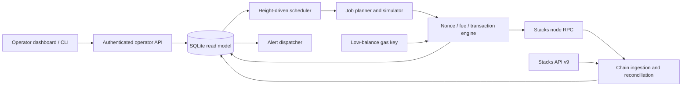

# Signer Sidekick: PoX-5 Pool Operator Control Plane

- **Status:** Approved v1 scope; activation and read-only control plane implemented, automation gated
- **Last updated:** July 14, 2026
- **Working name:** Signer Sidekick
- **Target:** Stacks 4.0 / PoX-5 (SIP-045)
- **Launch scope:** One STX-only pool and signer-manager per deployment
- **License:** GPL-3.0

This document is the proposed product and technical contract for v1. It is intended to be reviewed by Stacks protocol engineers, signer and pool operators, security reviewers, and the implementation team before the repository is scaffolded.

---

## 1. Executive decision

Build a clean, self-hosted operator control plane for a PoX-5 signer-manager. Do not port the PoX-4 transaction loop from `degen-lab/stacker-flow-automation`.

PoX-5 changes the pool primitive fundamentally:

- A pool is represented by a signer-manager contract.
- Stakers call PoX-5 directly and select that manager.
- The manager validates admission and records payout preferences.
- A stake can cover up to 96 cycles; the operator no longer accepts every delegation and recommits it every cycle.
- Rewards arrive as sBTC and must be calculated, claimed into the manager, allocated to stakers, and, when requested, withdrawn to Bitcoin L1.
- Most recurring manager operations are permissionless. The service therefore needs only a dedicated, low-balance gas-payer key.

The resulting v1 is primarily a state reconciler, safe transaction scheduler, setup assistant, and operator dashboard. It is not a signer daemon manager, a retail staking interface, or a PoX-4 compatibility layer.

### Confirmed v1 decisions

| Decision | v1 choice |
|---|---|
| Pool type | STX-only; no sBTC bond pooling |
| Manager | Upstream reference signer-manager behavior |
| Deployment cardinality | One network + one manager/signer per deployment |
| Runtime key | Dedicated low-balance gas-payer only |
| Admin key | Offline; never imported into the service |
| Signer key | Remains with signer operator; never imported into the service |
| Existing operators | Attach to an already deployed PoX-5 manager and existing node/signer setup |
| Fresh operators | Guided setup and verification for the PoX-5 manager/registration path |
| Signer health | On-chain registration and pool state only; host/process/signing health deferred to v2 |
| Default packaging | One OCI container with SQLite and an embedded web UI |
| Repository license | GPL-3.0, including the reference-manager artifact |

---

## 2. Product definition

Signer Sidekick is an open-source tool for the person responsible for operating a Stacks signer and an STX Stacking pool under PoX-5.

It should answer four questions continuously:

1. Is the signer-manager correctly deployed, granted, registered, and eligible for the current and next cycles?
2. Which stakers and amounts are assigned to the pool in each cycle?
3. Have all reward calculation, manager claim, staker payout, and withdrawal-settlement steps completed?
4. If something is wrong or approaching a deadline, what exactly must the operator do?

### 2.1 Primary users

- An existing signer/pool operator migrating from PoX-4.
- An operator with a working node and signer who needs to add a PoX-5 pool.
- A new operator following the full PoX-5 signer/pool checklist.
- A solo signer using the same manager model with only their own STX. They enroll their STX through an official staking interface like any other staker; Sidekick begins at manager setup, verification, and ongoing operation.

### 2.2 Explicit non-users

- People choosing a pool or submitting their own `stake` transaction.
- End users enrolling in protocol bonds.
- Custodial account holders managing reward preferences.

The product may generate operator-facing values and instructions that a pool publishes elsewhere, but it will not provide public wallet connection or staking enrollment flows.

### 2.3 Goals

- Make it safe to attach to an existing PoX-5 setup without redeploying or taking custody of powerful keys.
- Make a fresh PoX-5 setup understandable and verifiable end to end.
- Automate permissionless recurring pool operations with idempotent, height-aware jobs.
- Reconcile local state against authoritative contract read-onlys and indexed API data.
- Detect silent failures before they become missed rewards or payout backlogs.
- Remain small enough to run beside an existing signer stack.
- Produce a reproducible, supportable deployment with useful logs and a redacted support bundle.

### 2.4 Non-goals for v1

- Installing, upgrading, restarting, or configuring the Stacks node or `stacks-signer` process automatically.
- Reading signer metrics, logs, host resources, proposal responses, or block-signing performance. V1 may make one narrowly scoped, read-only version/liveness probe after the signer tooling team confirms its supported endpoint and response field.
- Competing with Slotwatch or other consensus-health products.
- Pooling sBTC protocol bonds, preparing SPV proofs, managing L1 bond lockups, or processing bond-member rewards.
- Hosting a public pool directory or end-user enrollment UI.
- Supporting multiple managers in one process.
- Supporting arbitrary custom signer-manager contracts for automation.
- Custody of a manager admin key or signer private key.
- Providing accounting-grade tax statements or a fiat-denominated rewards ledger.

---

## 3. Evidence baseline and protocol assumptions

The v1 design is based on the released Stacks 4.0.0 implementation, not an earlier `develop` snapshot.

### 3.1 Primary sources

- [SIP-045: PoX-5 / Bitcoin Staking](https://github.com/stacksgov/sips/blob/main/sips/sip-045/sip-045-pox-5-bitcoin-staking.md)
- [stacks-core 4.0.0 release](https://github.com/stacks-network/stacks-core/releases/tag/4.0.0)
- [`pox-5.clar` at the 4.0.0 tag](https://github.com/stacks-network/stacks-core/blob/4.0.0/stackslib/src/chainstate/stacks/boot/pox-5.clar)
- [Reference `signer-manager.clar` at the 4.0.0 tag](https://github.com/stacks-network/stacks-core/blob/4.0.0/contrib/core-contract-tests/contracts/signer-manager.clar)
- [Stacks Blockchain API v9.0.0 release](https://github.com/stx-labs/stacks-blockchain-api/releases/tag/v9.0.0)
- [API principal staking and reward claims PR #2582](https://github.com/stx-labs/stacks-blockchain-api/pull/2582)
- [API bond registrations PR #2579](https://github.com/stx-labs/stacks-blockchain-api/pull/2579)
- [API signer registry PR #2585](https://github.com/stx-labs/stacks-blockchain-api/pull/2585)
- [API deferred unlock state PR #2594](https://github.com/stx-labs/stacks-blockchain-api/pull/2594)
- [API signer stakers PR #2602](https://github.com/stx-labs/stacks-blockchain-api/pull/2602)
- [Draft stacks.js Bitcoin Staking package PR #1854](https://github.com/stx-labs/stacks.js/pull/1854)
- [PoX-4 reference automation](https://github.com/degen-lab/stacker-flow-automation)

### 3.2 Version pin

The initial protocol profile must pin to:

- `stacks-core` tag: `4.0.0`
- Git commit: `5595f08a244362cefc316f95b398510a2b8cb791`
- PoX-5 boot contract source and ABI from that tag
- A reproducibly generated, network-correct reference manager artifact derived from the reference source at that tag

Any later Stacks release or manager source change must create a new explicit protocol profile. It must not silently replace the v1 profile.

### 3.3 Activation facts and inference

Stacks 4.0.0 configures activation at Bitcoin block `960,230`, estimated for July 29, 2026. PoX-5 becomes active in the following reward cycle. Based on `/v2/pox` cycle boundaries observed on July 14, the first active PoX-5 reward cycle is expected to be cycle 141. This cycle number is an inference and must be confirmed from live chain state; no runtime behavior may depend on a hard-coded calendar date or inferred cycle.

The application must derive all cycle, prepare-phase, and distribution boundaries from the connected network's `/v2/pox` response and PoX-5 read-only functions.

At the 4.0.0 tag, public testnet has no practical scheduled Epoch 4.0 activation; its configured height is a far-future placeholder. Regtest/devnet is therefore the required rehearsal environment until an activated public test network is announced. Testnet support must be profile-driven rather than assumed.

### 3.4 Protocol behavior v1 must encode

- `stake` accepts a signer-manager, amount, number of cycles, start height, and optional manager calldata.
- `stake-update` handles signer changes, extensions, and increases, effective in the next cycle.
- The maximum stake duration is 96 cycles.
- Stake-changing entry points reject during the prepare phase.
- Signer-set inclusion requires at least `50,000 STX` for a cycle.
- The signer identity in PoX-5 is the signer-manager contract principal.
- A signer key authorizes the manager through a SIP-018 grant. Revoking the grant blocks new `stake` calls and `stake-update` calls that would extend, increase, or switch into that manager. The signer registration and existing obligations remain, so the pool enters a wind-down state rather than disappearing immediately.
- Rewards are distributed in half-cycle intervals, approximately weekly on mainnet.
- `calculate-rewards` is permissionless and requires the complete active bond-period list in protocol priority order, even for an STX-only manager.
- `claim-rewards` crystallizes a signer's newly accrued rewards into its manager. It can run after each half-cycle distribution, so a reward cycle may have multiple incremental manager claims.
- The reference manager's `claim-staker-rewards` then pays an individual staker in sBTC or initiates an L1 sBTC withdrawal according to stored calldata.
- Reference-manager claims and withdrawal settlement/reclaim calls are permissionless.

### 3.5 Important implementation nuances

#### Fee snapshots

The reference manager snapshots fee basis points for a `(reward-cycle, bond-index)` when the manager first calls `claim-rewards` for that tuple, using insert-only behavior. Later incremental claims in the same reward cycle retain that first snapshot. The current configured fee can therefore differ from the effective fee for a previously snapshotted cycle. If rewards accrued before the manager's first claim and the operator changed the fee in between, the fee at first claim time applies to that newly crystallized cycle.

The UI must show both the current configured fee and the effective fee snapshot for each claimed cycle. It must not describe a fee change simply as retroactive across already snapshotted cycles.

#### Manager balance and withdrawal liability

Pending L1 withdrawals have already moved sBTC out of the manager. Therefore `manager balance >= unclaimed rewards + withdrawal liability` is not a valid invariant.

Track separately:

- Manager sBTC balance.
- Unclaimed staker rewards still held by the manager.
- Earned manager fees still held by the manager.
- Live withdrawal liability recorded by the manager.
- Each withdrawal's registry state and returned funds, if rejected.

The safe local balance check is that funds physically expected to remain in the manager are covered, principally unclaimed rewards plus earned fees, allowing for accurately identified fee-refund dust. Withdrawal liability is reconciled against live manager mappings and the sBTC registry, not added blindly to expected cash balance.

---

## 4. Why this is a clean rewrite

The old PoX-4 app automated:

- `delegate-stack-stx`
- `delegate-stack-extend`
- `delegate-stack-increase`
- `stack-aggregation-commit-indexed`
- `stack-aggregation-increase`

Those calls and their delegation → acceptance → aggregation → commit state machine do not exist in PoX-5. The old application also parses event representation strings, stores signer and operator keys, manually sequences nonces, exposes a broadly open HTTP/SQLite surface, and rebuilds derived tables destructively.

Reusable ideas are limited to:

- A small self-hosted service and dashboard.
- Clear per-cycle operational visibility.
- A real regtest/devnet integration harness.
- Incremental, resumable event backfill with visible progress and cheap restarts.
- A mempool/in-flight transaction view for operators.
- An operator-configurable future-cycle forecast horizon, translated to PoX-5 eligibility and expiry monitoring.
- The principle that repetitive pool work should be automated and auditable.

No old database schema, transaction code, key handling, or frontend architecture should be copied into v1.

---

## 5. Operator journeys

### 5.1 Attach an existing PoX-5 pool

This is the lowest-risk and first implementation path.

1. Operator runs `sidekick init` and chooses **Attach existing manager**.
2. Operator supplies network and manager principal, plus optional node/API overrides. The API defaults to the network-appropriate Hiro endpoint.
3. Sidekick checks network agreement across node, API, address prefixes, chain ID, and PoX-5 profile.
4. It fetches the deployed manager source/ABI and compares it with known reference artifacts.
5. It discovers and backfills manager deployment, registration, signer key, grant status, fee history, stakers, cycle memberships, manager claims, staker claims, and withdrawals.
6. It verifies key facts directly with PoX-5 and manager read-only calls.
7. It presents a reconciliation report, including unsupported bond positions or source differences.
8. It begins in **Observe** mode. No transaction is broadcast.
9. The operator configures a dedicated gas payer, alert destinations, payout policy, and confirmation policy.
10. The operator explicitly enables individual automation jobs after reviewing a dry-run plan.

Attach rules:

- Sidekick never redeploys or replaces a manager during attach. An already deployed and registered compatible reference manager is the expected case.
- A manager deployed outside Sidekick can enter automation mode when its on-chain source is recognized as the supported reference implementation or a reviewed network-specific equivalent. Recognition is limited to a byte-exact rendered artifact, trivial lexical canonicalization of whitespace/comments, or an explicit allowlist of independently reviewed on-chain source hashes. General AST or semantic-equivalence matching is not an automation gate.
- ABI similarity alone is not enough for automation because a custom contract can expose the same function names with different payout or authority behavior. A genuinely custom or unreviewed implementation remains read-only until a reviewed adapter/profile is installed.
- A manager with active bond participants is flagged as outside v1. Bond-index automation remains disabled.
- A PoX-4 operator without a PoX-5 manager follows the fresh-manager path; their existing node and signer can still be reused.

### 5.2 Fresh PoX-5 signer/pool setup

The wizard guides and verifies the complete path but does not install or control the node or signer process.

1. **Prerequisite check**
   - Supported Stacks node version and epoch readiness.
   - Node RPC reachable and on the selected network.
   - API v9 reachable, caught up, and on the same chain. Default to Hiro; accept an operator-supplied self-hosted URL and optional API key.
   - Signer installed/configured by the operator and its public key available.
   - Offline manager admin principal selected.
2. **Manager artifact**
   - Select the pinned reference-manager profile.
   - Render the network-specific contract from a checked-in manifest.
   - Show every substituted contract principal and the resulting source hash.
   - Refuse to deploy the raw `contrib/core-contract-tests` file without network validation.
3. **Deploy manager**
   - Produce a human-readable deployment manifest and unsigned/admin-signed transaction instructions.
   - The operator signs outside Sidekick with the offline admin wallet.
   - Sidekick watches for confirmation and verifies deployed source hash.
4. **Signer grant ceremony**
   - Choose a unique `auth-id` and derive the SIP-018 grant hash from the live PoX-5 contract.
   - Give the operator the released signer-side command: `stacks-signer generate-staking-signature --config <file> --signer-manager <principal> --auth-id <uint> --json`.
   - Display the manager principal, network, signer key, auth ID, and hash for out-of-band verification.
5. **Register the manager**
   - Prepare the admin-authorized `register-self` call containing the signer grant signature.
   - Watch confirmation and verify `get-signer-info` plus `verify-signer-key-grant` directly.
   - Before any retry, reconcile transaction, registration, and grant state. Never replay a successfully consumed `(signer-key, manager, auth-id)` tuple; request a new signer payload only when a new auth ID is actually required.
6. **Configure pool policy**
   - Confirm initial manager fee.
   - Select payout cadence, dust threshold, L1 fee behavior, gas budget, confirmations, and alerts.
   - Admin-only fee changes remain an offline transaction; Sidekick monitors the result.
7. **Configure automation identity**
   - Add/fund a dedicated low-balance gas payer.
   - Verify it is not a manager admin and is not the signer identity.
8. **Final verification**
   - Contract source and profile recognized.
   - Signer key registered and grant currently valid.
   - Current/next-cycle membership and amount shown.
   - 50,000 STX signer-set threshold status shown.
   - All enabled jobs run in dry-run mode successfully.

The final setup screen produces a printable operator record with no secrets: network, contract principal, source hash, signer public key, auth ID, admin principal, gas-payer principal, fee, policy, verification heights, and remaining actions.

### 5.3 Normal cycle operation

An operator should normally open the dashboard and see:

- Current burn height, reward cycle, distribution half, and prepare-phase status.
- Whether global rewards for the relevant distribution have been calculated.
- Current and next-cycle pool STX, signer-set eligibility, incoming and expiring positions.
- Manager claim status for each distribution checkpoint in the reward cycle.
- Staker payout progress and outstanding value.
- L1 withdrawal states and oldest pending request.
- Gas-payer balance and transaction/job health.
- A concise list of required manual actions, if any.

### 5.4 Recovery operation

For any failed or delayed job, the operator sees:

- Intended contract call and arguments.
- Trigger height and deadline/policy threshold.
- Simulation/read-only result.
- Every transaction attempt, nonce, fee, txid, and chain status.
- Classified error and whether retry is safe.
- Recommended next action.

Retries reuse the same logical idempotency key. The operator never has to guess whether a duplicate claim or settlement is safe.

### 5.5 Pool enrollment information artifact

Sidekick generates an embeddable pool card and versioned JSON that an operator hosts on a site they already run. Sidekick itself exposes no public route. It does not connect a staker wallet, encode user-specific calldata, sign, or submit a stake.

The page includes only information needed to identify and evaluate the pool in an official interface:

- Pool display name, operator website/support contact, and network.
- Signer-manager principal and recognized manager profile/source hash.
- Current registered signer public key and live grant status.
- Current configured fee and an explanation that effective cycle fees are snapshotted on manager claim.
- Supported reward destinations: direct sBTC and, if enabled by the reference manager, Bitcoin L1.
- Supported stake-duration policy, current enrollment/prepare-phase window, and current/next-cycle signer-set eligibility.
- Current pool STX total and margin above/below the 50,000 STX threshold.
- Copy buttons, explorer links, data height/freshness, and links into supported official enrollment platforms.

The generator offers a live artifact, which may query only unauthenticated public chain/API endpoints from the operator's site, and a static HTML/JSON snapshot with values baked in. It must never embed the operator's API key or expose the gas payer, job internals, alerts, or local database data. Provider-specific sections are adapters over this metadata and ship only after the provider publishes or confirms its PoX-5 requirements. The card must not request an amount, Bitcoin address, wallet connection, signature, or transaction approval.

Visually this remains a compact product-information surface, not a marketing landing page. It uses the same tokens, network treatment, data-freshness semantics, and accessibility requirements as the operator dashboard, with no persuasive copy or decorative modules.

---

## 6. v1 functional scope

### 6.1 Registration and eligibility

- Manager source/profile verification.
- Registered signer key for the manager.
- Live grant verification and revocation detection.
- Current and next-cycle signer-set membership.
- STX delegated to the manager by cycle.
- Pending STX for future cycles.
- Distance above/below the 50,000 STX threshold.
- Prepare-phase and next effective-change deadline.
- Registration/grant event history.

This is protocol registration health, not signer-machine health. SIP-045 specifies no slashing or protocol-level principal loss in PoX-5, and the reward contracts account from stake/reward state rather than signer-host telemetry. Signer performance remains consensus-critical, but it is already covered by operator monitoring and does not need to expand this v1 control plane.

### 6.2 Pool positions

- Enumerate STX-only stakers assigned to this manager.
- Show amount, first cycle, duration, last cycle, and status.
- Ingest `stake`, `stake-update`, and `unstake` as first-class lifecycle events.
- Show next-cycle joins, increases, extensions, signer switches, unstake/reductions, and expirations when available from indexed data/events.
- Preserve the distinction between an `unstake` transaction and the later cycle-end unlock: STX remains locked until the returned unlock burn height even though future membership changes.
- Forecast the cycle in which departures/expirations would push the manager below 50,000 STX.
- Reconcile aggregate per-cycle totals with PoX-5 read-only values.
- Show payout preference recorded by the reference manager: direct sBTC or Bitcoin L1 plus maximum fee.
- Export the operator's pool roster and reward ledger as CSV/JSON.

No user wallet, stake submission, or public enrollment route is included.

### 6.3 Reward operations

- Observe PoX-5 global reward calculation state and active bond-period ordering.
- Run a race-tolerant global calculation fallback after a configurable grace period and randomized jitter; if another caller already calculated it, reconcile that as success. This fallback remains disabled by default until the expected primary caller and launch-operations grace window are confirmed with the core team.
- Claim the manager's newly available rewards after each completed calculation checkpoint.
- Snapshot and display the effective fee for each STX-only reward cycle.
- Calculate claimable reward per staker from manager/PoX-5 read-onlys.
- Trigger individual permissionless staker claims according to policy.
- Reconcile gross rewards, fees, net staker rewards, manager balance, and outstanding unclaimed value.
- Treat a zero STX-only reward/share result as valid when the cycle has no eligible STX-only shares; do not report an accounting discrepancy merely because that portion flowed to the protocol reserve.

V1 uses one manager call per staker claim. A batch periphery contract is deferred until real pool size, gas, failure isolation, post-condition behavior, and audit needs are measured. This avoids adding an unaudited contract dependency to launch.

### 6.4 L1 reward withdrawals for STX-only stakers

STX-only pool scope does not imply sBTC-only payouts. The reference manager permits a staker to request Bitcoin L1 payout through signer calldata.

V1 therefore includes:

- Skip a claim while net earned rewards are below the staker's configured `max-fee` threshold.
- Record the withdrawal request ID emitted by a successful claim.
- Reconcile the request against the sBTC registry.
- On rejection, call `reclaim-failed-withdrawal` so returned sBTC is paid to the staker.
- On acceptance, call `settle-accepted-withdrawal` to retire manager liability and make returned fee dust sweepable.
- Report pending age, accepted/rejected state, liability, and settlement tx.

Admin-only `sweep-fee-refunds` is monitored but not automatically executed in v1.

### 6.5 Alerts

V1 ships a generic signed webhook destination plus Slack/Discord-compatible payload templates. Alert records are also always visible in the UI.

Required alerts:

- Manager source or network profile mismatch.
- Signer grant revoked or verification failed.
- Pool wind-down after grant revocation: new stakes and extensions/increases/switches into the manager are blocked while existing positions expire.
- Current or next-cycle signer-set amount below threshold.
- Forecast signer-set amount below threshold within the configured cycle horizon.
- Unexpected drop in next-cycle delegated amount.
- A staker's stored payout preference disappears or changes following `stake` or `stake-update` ingestion.
- Entering prepare phase with a material pool-state warning.
- Global reward calculation delayed beyond configured policy.
- Manager claim delayed or failed.
- Staker payout backlog count/value/age over threshold.
- L1 withdrawal pending beyond threshold, rejected and unreclaimed, or accepted and unsettled.
- Manager held-balance reconciliation mismatch.
- Gas payer below minimum balance.
- Transaction stuck, dropped, aborted, or repeatedly replaced.
- API and node disagree or ingestion falls behind.
- Automation paused by Sidekick's circuit breaker.

Alerts have severity, first/last seen height, deduplication key, acknowledgement, resolution, and supporting evidence. Repeated polling must not spam a destination.

### 6.6 Application health

Although signer-host monitoring is deferred, Sidekick itself must expose:

- Liveness and readiness endpoints.
- Structured logs with secret redaction.
- Job, ingestion, transaction, and alert counters suitable for Prometheus/OpenTelemetry export.
- Database migration and corruption checks.
- Redacted diagnostic bundle export.

---

## 7. Automation modes and safety posture

Each deployment has a global mode and per-job enable switches.

| Mode | Behavior |
|---|---|
| Observe | Ingest, reconcile, display, and alert; never sign or broadcast |
| Assist | Build and simulate eligible jobs; operator approves each broadcast |
| Automate | Broadcast explicitly enabled permissionless jobs within policy limits |

Fresh and attached deployments start in Observe mode.

Even in Automate mode:

- Admin-only operations are never signed.
- Global reward calculation remains separately gated.
- A reconciliation failure, network mismatch, unknown manager profile, or repeated unexpected contract error trips a local circuit breaker.
- The operator can pause all new broadcasts without stopping ingestion.
- Already broadcast transactions continue to be tracked to a terminal/reconciled state.

---

## 8. System architecture

### 8.1 Recommended repository layout

```text
apps/
  sidekick/                 API, worker, scheduler, CLI, static UI hosting
  dashboard/                React operator interface
design/                     vendored Stacks Labs tokens, fonts, and design guidance
packages/
  protocol/                 PoX-5/manager profiles, ABIs, adapters, codecs
  core/                     domain, ingestion, reconciliation, jobs, tx engine
contracts/
  reference-manager/        pinned GPL source and generated artifacts
test/
  fixtures/                 fake clients, replay fixtures, contract vectors
  integration/              regtest/devnet lifecycle and UI tests
docs/
  operator/                 setup, PoX-4 transition, recovery, security runbooks
  architecture/             ADRs and protocol-profile notes
```

Keep the thin `ManagerAdapter` safety boundary inside `protocol`, but do not split each internal concern into a published package until a second consumer or implementation proves the boundary.

### 8.2 Technology choices

- TypeScript with strict compiler settings.
- pnpm workspace/lockfile.
- A currently supported Node.js LTS runtime, pinned in the release image.
- Fastify for the local API and static dashboard hosting.
- React + Vite + TanStack Query for the dashboard.
- The vendored Stacks Labs design tokens in `design/tokens/tokens.css`, consumed through a thin local React component layer rather than copied ad hoc into screens.
- Phosphor React icons for standard UI affordances. Brand/token marks must use canonical SVG assets when they are added; do not redraw them.
- Accessible headless primitives for dialogs, menus, tooltips, and other complex interactions. Select React Aria or Radix after a short implementation spike and record the choice in an ADR.
- SQLite in WAL mode with explicit migrations; a typed query layer such as Drizzle.
- Zod or TypeBox schemas shared at process/config/API boundaries.
- Pino-compatible structured logging.
- Vitest for unit/integration tests and Playwright for critical UI flows.

These are implementation defaults, not protocol constraints. Changes should be recorded as architecture decisions before scaffolding.

### 8.3 Runtime processes

The same image exposes three roles:

- `sidekick serve`: API and dashboard.
- `sidekick worker`: ingestion, reconciliation, scheduler, and transaction tracking.
- `sidekick all`: both roles in one process tree for the default single-container deployment.

V1 supports one active worker and one SQLite writer. Horizontal scaling and Postgres are out of scope.

### 8.4 Deployment topology

Default Docker Compose deployment:

- One Sidekick container.
- One persistent volume for SQLite, config, and generated non-secret artifacts.
- One secret mount for the gas-payer key.
- Connection to the operator's existing Stacks node RPC, preferably over localhost/private networking.
- Connection to a Stacks API v9 endpoint. Use the network-appropriate Hiro API by default, with a configurable self-hosted base URL and optional secret API key.
- Optional read-only connection to a confirmed signer version/liveness endpoint; no signer metrics, logs, signing activity, or key material.
- Loopback-only HTTP bind by default; reverse proxy/TLS documented for remote use.

Sidekick may run on the signer host, but it does not mount signer configuration, signer keys, Docker socket, or host process controls. The optional signer connection is restricted to the externally configured version/liveness endpoint.

### 8.5 Internal component boundaries



The chain clients return typed protocol values. UI code never decodes raw Clarity values, and transaction code never queries ad hoc frontend state.

---

## 9. Chain data and source-of-truth policy

### 9.1 Source hierarchy

1. **PoX-5 and manager read-only calls through the local node** are authoritative for current actionable state.
2. **Local node tip and `/v2/pox`** are authoritative for current height, network, and cycle boundaries.
3. **Stacks API v9 indexed data and events** provide enumeration, history, backfill, and transaction enrichment.
4. **Sidekick's SQLite projection** is a cache and audit trail, never the final authority for a broadcast decision.

API-derived reward estimates must be labeled as indexed/estimated when they are not identical to a contract read-only result.

### 9.2 Degraded behavior

- If the API is unavailable, Sidekick continues tracking known jobs/transactions and verifies known principals with read-onlys; discovery/backfill pauses.
- If the node is unavailable or behind the API, all new broadcasts stop.
- If node and API network identities differ, the deployment enters a hard error state.
- If the API cursor lags beyond policy, display stale timestamps/heights and suppress decisions requiring complete enumeration.
- An API URL/key change first runs network, version, schema, and lag checks. Cursors are stored per API source identity so changing providers cannot accidentally continue an incompatible cursor.
- Hosted and self-hosted API clients honor `Retry-After`, use bounded concurrency and exponential backoff with jitter, and expose rate-limit/429 status without turning a temporary throttle into data loss.

### 9.3 Event ingestion

- Decode Clarity values structurally from event hex/typed values; never parse `repr` strings.
- Store raw event payload, txid, event index, block identifiers, canonical/microblock flags, decoded schema version, and ingestion source.
- Use a durable cursor and overlapping replay window.
- Roll back or mark derived records non-canonical on reorg/microblock change.
- Make reducers deterministic and replayable from raw events.
- Periodically re-run manager and PoX-5 read-only reconciliation even when no event was observed.
- Backfills are incremental, resumable, and report cursor/height progress in the CLI and UI.

V1 retains the manager-relevant PoX-5 events it ingests rather than all chain activity. These raw audit events are retained indefinitely by default because replayability is valuable and expected volume is modest; Sidekick monitors database size and supports operator export/archive before any future pruning policy is introduced.

### 9.4 Protocol adapters

The `ManagerAdapter` interface owns:

- Source/ABI recognition.
- Read-only calls and decoded return types.
- Event decoding.
- Permissionless transaction construction.
- Balance and liability reconciliation rules.
- Feature declaration, including STX-only and L1 payout support.

Only the pinned reference-manager adapter ships enabled in v1. An unknown adapter cannot inherit transaction behavior merely because function names look similar.

---

## 10. Persistent data model

The schema should preserve raw evidence and materialized operator views separately.

| Table/group | Purpose |
|---|---|
| `deployments` | Network, node/API endpoints, manager, profile, operating mode |
| `protocol_profiles` | Pinned source hashes, ABIs, principals, feature flags |
| `chain_cursors` | Durable API/event cursor and reconciliation heights |
| `chain_events` | Immutable raw + decoded canonical event records |
| `signer_registrations` | Manager signer key, grant state, registration history |
| `stakers` | Principal and manager payout preference |
| `stake_positions` | Current high-level STX-only position |
| `cycle_memberships` | Staker and signer amount per reward cycle |
| `cycle_snapshots` | Pool totals, threshold status, preparation timing |
| `reward_distributions` | Global half-cycle calculation state and active bonds input |
| `manager_claims` | Incremental manager claim by distribution checkpoint, cycle, and effective fee snapshot |
| `staker_claims` | Incremental gross, fee, net, destination, cycle/checkpoint, tx, status |
| `withdrawal_requests` | Request ID, staker, amount, max fee, registry and settlement state |
| `balance_snapshots` | sBTC balance, unclaimed rewards, earned fees, liabilities, dust |
| `jobs` | Logical idempotent operation and state |
| `transaction_attempts` | Nonce, fee, serialized tx reference, txid, chain lifecycle |
| `alerts` | Dedupe, severity, evidence, acknowledgement, resolution |
| `audit_log` | Local config/mode/job actions and actor |

Rules:

- Store Clarity uints as canonical decimal strings and use `bigint` in application code; do not rely on JavaScript `number` or SQLite's signed range at protocol boundaries.
- Use atomic units (`uSTX`, sats) internally. Format STX/BTC only at presentation boundaries.
- Uniqueness constraints encode protocol identity, such as `(chain_id, txid, event_index)` and logical job keys.
- Store timestamps for operator convenience but schedule and reconcile using chain heights.
- Database migrations are forward-only and backed up automatically before upgrade.
- Forecast horizon is configuration, not schema: materialize enough future cycle membership to support the operator-selected warning horizon.

---

## 11. Job and transaction engine

### 11.1 Common job state machine

```text
discovered -> eligible -> planned -> simulated -> broadcast -> mempool
    -> confirmed -> reconciled -> succeeded

Terminal/side states: skipped, superseded, paused, failed, reorged
```

A transaction confirmation is not job success. Success requires a post-confirmation read-only or indexed-state reconciliation proving the intended effect.

### 11.2 Idempotency keys

Examples:

- Distribution: `(chain, distribution-index)`
- Manager claim target: `(chain, manager, distribution-index, reward-cycle, target-rewards-per-token)`
- STX-only staker claim target: `(chain, manager, staker, reward-cycle, none, target-signer-rewards-per-token)`
- Withdrawal reclaim/settle: `(chain, manager, request-id, action)`

Permissionless race outcomes are classified explicitly. If another caller completed the intended action, Sidekick reconciles and marks its job succeeded/superseded rather than alerting as a failure.

Error classification is evidence-based: `ERR_DISTRIBUTION_ALREADY_COMPUTED` is benign; no-claimable and withdrawal-state errors are benign only after read-only reconciliation proves another caller satisfied the target. An error code alone must not turn a stale or malformed job into success.

The target rewards-per-token checkpoint is important: both halves of a reward cycle can produce new rewards, and an operator may catch up both with a single later claim. In that case, older logical jobs are marked satisfied/superseded when the settled on-chain checkpoint has advanced past their target.

### 11.3 Nonce and fee management

- Reserve gas-payer nonces transactionally in SQLite.
- Reconcile account nonce with confirmed and mempool transactions before every new sequence.
- Never manually increment an in-memory counter as the sole nonce source.
- Track replacement relationships and use bounded fee escalation.
- Enforce maximum fee per transaction and gas budget per time window.
- Pause broadcasts on an unexplained nonce gap or competing external transaction until reconciled.
- At startup, compare recent confirmed and mempool transactions from the gas payer with local transaction records. Any unknown transaction from that dedicated account trips a loud single-writer/foreign-use alert and blocks new broadcasts until adopted or resolved.
- Hold a local worker lease to prevent two workers sharing the same SQLite volume. Document that separate deployments must never share a gas-payer key; the foreign-use check is the defense for accidentally duplicated containers with separate volumes.

### 11.4 Transaction construction

- Build manager wrapper calls from Sidekick's pinned ABI; do not depend on draft stacks.js package exports.
- Use released stacks.js primitives where stable, but own and test PoX-5/manager argument construction.
- Verify Epoch 4.0 `Staking` (`0x03`) and `Pox` (`0x04`) post-condition serialization and deny-mode behavior during Milestone 1. Patch or own the minimum codec support if the released JavaScript stack does not expose it.
- Simulate/read current state immediately before signing.
- Use deny-by-default post-condition mode and explicit asset-transfer expectations where the transaction supports reliable post conditions.
- Persist an argument summary and hash of the unsigned transaction before signing.
- Redact serialized signed transactions and key material from ordinary logs/support bundles.

### 11.5 Job definitions

#### A. Global distribution watchdog

- Derive current distribution index from PoX-5.
- Observe `get-new-rewards` and the last reward-compute height as calculation inputs/readiness evidence.
- Build the complete active bond list and validate ordering against read-onlys.
- Preflight the list with `assert-all-active-bonds-included` before broadcast.
- Observe whether calculation completed and when.
- Alert if it exceeds the configured operational threshold.
- While the separately gated fallback is enabled, broadcast `calculate-rewards` after the configured grace period and randomized jitter if it remains uncomputed. The gate defaults off until the core team confirms the expected caller and initial grace policy.
- `ERR_DISTRIBUTION_ALREADY_COMPUTED` is a successful race outcome.

#### B. Manager reward claim

- Requires global calculation to be complete and the manager to have newly claimable rewards according to authoritative read-only state.
- Use `get-earned` and rewards-per-token settlement read-onlys rather than a fixed time delay.
- Determine exact active bond-period arguments even in STX-only mode.
- Confirm the manager has claimable value beyond its last settled rewards-per-token checkpoint.
- Call reference manager `claim-rewards`.
- Reconcile manager unclaimed rewards, effective fee snapshot, sBTC balance, and claim event.

#### C. STX-only staker payout

- Requires a manager claim at or beyond the target distribution checkpoint to be reconciled.
- Enumerate `(staker, reward-cycle, bond-index none)` candidates.
- Read gross/net/fee and payout preference immediately before broadcast.
- Apply minimum payout, gas budget, and L1 max-fee policies.
- Call one `claim-staker-rewards` per eligible staker.
- Reconcile direct sBTC transfer or capture the L1 withdrawal request.
- Bound concurrency to preserve nonce order and isolate failures.

#### D. Withdrawal janitor

- Poll known request IDs from the sBTC registry.
- Verify manager ownership with `get-withdrawal-request-staker` before acting.
- Leave pending requests untouched and age them for alerting.
- For accepted requests, call `settle-accepted-withdrawal` and reconcile liability release.
- For rejected requests, call `reclaim-failed-withdrawal` and reconcile staker repayment.
- Treat already-settled/reclaimed results as successful races when proven by state.

#### E. Reconciler

- Run at startup, on relevant events, at cycle/distribution boundaries, before a transaction, and periodically.
- Compare database projection with node read-onlys and API aggregates.
- Produce typed discrepancies with severity and safe behavior.
- Trip the local circuit breaker for discrepancies that could change transaction recipients, amounts, cycle, or manager identity.

### 11.6 Scheduling

- The scheduler is driven by burn height and contract-derived boundaries, not wall-clock cron.
- Wall-clock timers only determine polling frequency and alert reminders.
- Each job has a configurable confirmation/finality policy appropriate to its risk.
- Startup always reconciles before evaluating overdue work.
- A delayed process can safely catch up old manager/staker claims without replaying completed operations.

---

## 12. Operator interface

### 12.1 Design-system contract

The dashboard and public pool enrollment-information page use the vendored Stacks Labs design system under `design/`. `design/tokens/tokens.css` is the implementation source for color, type, spacing, radius, elevation, and light/dark semantics. Screens and components must use semantic variables from that file; hard-coded brand hex values or locally invented surface tiers are not permitted.

The local component layer should stay small and product-specific. Its initial primitives are:

- `AppShell`, `PageHeader`, `Section`, and the two legal card forms.
- `NetworkBadge`, `DataFreshness`, `StatusBadge`, `AlertBanner`, and `Toast`.
- `Metric`, `CycleCountdown`, `ThresholdMeter`, and `PipelineProgress`.
- `Address`, `TxId`, `BlockHeight`, and `Amount`, each with the correct typography, truncation, copy, and explorer-link behavior.
- `DataTable`, filters, pagination, loading/empty/error states, and CSV/JSON export actions.
- `FormCard`, `ConfirmationDialog`, `CallManifest`, and `JobTimeline`.

A small product theme layer may define operator-oriented semantic aliases such as `--accent`, `--status-success-*`, and `--status-warning-*`, but each alias must resolve to an existing vendored token. It also owns the explicit `[data-network="testnet"]` remapping because the current token file defines the violet scale but does not perform that network switch automatically.

The design rules most important to this product are mandatory:

- The app shell is one continuous `--surface-tertiary` tone separated by `--border-secondary` rules.
- Quiet cards use the page tone plus a border. Standout and all form-bearing cards use `--surface-primary` with no border. Generic white cards, tinted alert cards, gradients, glass effects, and left-edge alert stripes are not allowed.
- Matter is used for headings and heading-like quantities, Instrument Sans for prose, and Matter Mono only for identifiers and tabular digit columns. Table numbers are right-aligned; labels are left-aligned.
- Mainnet uses the Stacks accent. Testnet replaces that accent with testnet violet throughout the shell and primary actions, and every network indicator also includes explicit text so color is never the only distinction.
- Status color follows the semantic feedback palette, but every state also includes a label and, where helpful, a Phosphor icon. Stale or contradictory state can never inherit a success treatment.
- Both light and dark themes are first-class. The layout is verified at 1440px, 768px, and 375px; dense desktop tables may become labeled rows or horizontally scroll with a clear affordance on narrow screens.
- Product copy is declarative, factual, and slightly technical. Use Title Case for controls and headings, no emoji or exclamation marks, and dry empty states.
- Motion is limited to purposeful 150–200ms ease-out transitions and respects `prefers-reduced-motion`.
- The dashboard and public enrollment page target WCAG 2.2 AA, including visible focus, keyboard operation, semantic tables/forms, error association, contrast, and touch targets.

The detailed closed surface-system rules in `design/README.md` and `design/SKILL.md` take precedence over the contradictory `Default card` shorthand row currently present in `design/SKILL.md`. The canonical default is the documented quiet card: `--surface-tertiary` plus `--border-secondary`.

### 12.2 Navigation

1. **Overview**
2. **Registration**
3. **Pool**
4. **Rewards**
5. **Operations**
6. **Initial Setup**
7. **Public Pool Page**
8. **Settings**

### 12.3 Screen jobs

Each screen must answer one primary operator question. Supporting modules remain visually subordinate.

| Screen | Primary question |
|---|---|
| Overview | Does this pool require intervention now? |
| Registration | Can the manager and signer accept and retain eligible stakes? |
| Pool | Which positions count now and in upcoming cycles? |
| Rewards | Where, if anywhere, is the reward pipeline blocked? |
| Operations | What is queued, in flight, failed, or awaiting approval? |
| Setup | What must this operator complete next to attach or launch safely? |
| Public Pool Page | What reviewed artifact should the operator publish on their own site? |
| Settings | Which ongoing deployment and display settings are active? |

### 12.4 Overview

- Network and data freshness banner.
- Current burn height, reward cycle, distribution half, prepare phase, and countdown in blocks.
- Current/next-cycle pool total and threshold status.
- Registration/grant status.
- Rewards pipeline summary: calculated → manager claimed → stakers paid → withdrawals settled.
- Gas payer balance.
- Active alerts and required operator actions.

### 12.5 Registration

- Manager principal, source profile, deployment tx, and source hash.
- Signer public key, registration state, and grant verification.
- Admin principals known from deployment/event history, clearly labeled if enumeration is incomplete.
- Current and next-cycle signer-set membership and weights.
- Grant/register/revoke timeline.
- Setup verification checklist and offline remediation instructions.

### 12.6 Pool

- Searchable staker roster.
- Per-position amount and cycle range.
- Current/next-cycle joins, changes, and expirations.
- Pool totals by future cycle and threshold margin chart.
- Direct sBTC vs L1 payout preference counts.
- CSV/JSON export.

### 12.7 Rewards

- Global distribution status and active bond context.
- Manager claims by distribution checkpoint within each reward cycle.
- Current configured fee versus snapshotted effective fee.
- Gross rewards, staker net, fees, paid value, and remaining value.
- Per-staker claim status.
- Withdrawal queue with registry and settlement states.
- Balance/liability reconciliation evidence.

### 12.8 Operations

- Global Observe/Assist/Automate mode and circuit-breaker state.
- Per-job enablement and policy.
- Job list with arguments, simulations, attempts, and final reconciliation.
- Nonce/mempool view for the gas payer.
- Alert rules, destinations, delivery history, and acknowledgements.
- Manual retry/approve/pause actions with audit log.

### 12.9 Setup

- Attach/fresh wizard state.
- Node/API/profile preflight.
- Manager artifact/deployment verification.
- Signer grant and registration ceremony.
- Gas-payer and alert configuration.
- Dry-run report and mode activation.
- Redacted operator record and support bundle export.

### 12.10 Settings and generated pool artifact

- Ongoing data-source settings with network-appropriate Hiro defaults, custom/self-hosted API URL, optional API key, connection test, detected API version, and indexed-tip lag.
- Pool display name, website/support contact, display/time/number/theme preferences, payout policy, automation/alert policy, access/security status, and maintenance exports.
- Optional signer version/liveness endpoint and polling interval, pending confirmation of the exact signer-tooling contract.
- Live/static pool-card generator, reviewed public-field allowlist, official-platform links, and preview. Sidekick hosts no public pool route.

### 12.11 UI principles

- Show block heights before estimated times.
- Mark API-estimated, locally derived, and contract-authoritative values distinctly.
- Explain protocol errors in operator language while retaining raw error codes.
- Never show a green status from stale data.
- Never expose private keys, mnemonics, complete signed transaction bytes, or secrets in the browser.
- Destructive local actions and broadcasts require explicit confirmation in Assist mode.

---

## 13. CLI and local API

### 13.1 Initial CLI surface

```text
sidekick init
sidekick attach
sidekick preflight
sidekick manager render
sidekick manager verify
sidekick pool enrollment-info
sidekick pool sync-stakers <manager-principal>
sidekick pool status <manager-principal>
sidekick rewards status <manager-principal> [reward-cycle]
sidekick setup status
sidekick doctor
sidekick config validate
sidekick jobs list
sidekick jobs plan <job-id>
sidekick jobs run <job-id>
sidekick reconcile
sidekick export support-bundle
sidekick serve
sidekick worker
sidekick all
```

Stacks 4.0.0 ships `stacks-signer generate-staking-signature --config <file> --signer-manager <principal> --auth-id <uint> --json`. The wizard must present this command for execution on the signer host, validate its JSON output, independently derive the expected hash from the connected PoX-5 contract, and never read the signer config itself.

### 13.2 Local API groups

- `/api/v1/status`
- `/api/v1/registration`
- `/api/v1/pool/*`
- `/api/v1/rewards/*`
- `/api/v1/withdrawals/*`
- `/api/v1/jobs/*`
- `/api/v1/alerts/*`
- `/api/v1/setup/*`
- `/health/live`, `/health/ready`, `/metrics`

All operator API endpoints require authentication. `/metrics` is intentionally unauthenticated for local Prometheus collection and must remain loopback-bound or protected by the operator's reverse proxy. The application has no public pool-information route; it generates artifacts for the operator to host elsewhere. Mutating routes enforce CSRF protection for browser sessions, local role checks, audit logging, and current-mode constraints.

### 13.3 Configuration

Non-secret configuration includes:

- Network/chain ID.
- Node RPC URL.
- API base URL, defaulting to the network-appropriate Hiro API.
- Optional API-key secret reference for hosted or self-hosted API providers.
- Manager principal and required protocol profile.
- Confirmation and staleness policies.
- Automation mode and per-job policies.
- Payout thresholds and gas budgets.
- Alert destinations by secret reference.
- HTTP bind/auth settings.
- Pool identity: display name, website/support contact, enabled reward destinations, and official-platform links.
- Optional signer version/liveness endpoint and polling interval.
- Display timezone, absolute/relative time mode, number format, and light/dark/system theme.
- Pool-card artifact type (`live` or `static`) and unauthenticated public API URL. A live artifact may never contain the operator API key.

Secret references include only:

- Gas-payer key provider.
- UI credential/session secret.
- API key, when configured.
- Webhook credentials.

The operator can change the API URL and API key through setup/configuration without rebuilding the container. Sidekick validates the replacement endpoint before switching, never returns the stored API key to the browser, and resumes ingestion using a cursor associated with the new source rather than reusing the prior provider's cursor blindly.

Manager admin and signer keys are invalid configuration fields and should cause validation failure if supplied under common names.

---

## 14. Security and trust model

### 14.1 Key separation

| Identity | Where it lives | Sidekick access |
|---|---|---|
| Signer private key | Signer-controlled environment | Never |
| Manager admin key | Offline wallet/hardware/multisig workflow | Never |
| Gas-payer key | Dedicated low-balance secret provider | Sign permissionless calls only |
| UI/session secret | Secret mount/provider | Local authentication only |

The gas payer has no special contract authority. Its loss should expose only its funded STX and the ability to pay gas for permissionless calls that anyone can already make.

When configured after its supported endpoint contract is confirmed, Sidekick may make an unauthenticated read-only version/liveness probe to the signer. This probe never reads signer metrics, logs, proposal responses, signing performance, host state, configuration files, or key material.

### 14.2 Supported key providers

V1 requires a provider interface and ships file/Docker-secret or environment injection. The documented production default is a read-only secret mount with restrictive filesystem permissions. KMS/HSM adapters may follow without changing the transaction engine.

### 14.3 Threats and mitigations

| Threat | Mitigation |
|---|---|
| Compromised API returns false pool state | Verify actionable state through local node read-onlys |
| Wrong network/manager | Chain ID, address, source-hash, and boot-contract profile checks before every broadcast |
| Duplicate permissionless transaction | Durable idempotency + preflight read + post-confirmation reconciliation |
| Nonce collision | Transactional reservation and mempool/account reconciliation |
| Malicious/custom manager mimics ABI | Exact reviewed source/profile required for automation |
| Reorg changes an observed event | Canonical cursor/replay and reconciled job state |
| Service compromise | No admin/signer keys; low gas balance; authenticated local API |
| Secret leakage in logs/support | Central redaction, negative tests, no signed bytes in normal logs |
| Runaway fees/retries | Per-tx and rolling gas caps, bounded replacement, circuit breaker |
| Supply-chain drift | Lockfile, pinned base image/dependencies, SBOM, signed releases |

### 14.4 Authentication

The service binds to loopback by default. V1 should provide a single-operator local login/session or high-entropy bootstrap credential, with secure cookie and CSRF protection. Reverse-proxy authentication may be supported, but trusting arbitrary forwarded identity headers is disabled by default. Multi-user RBAC and OIDC are post-v1.

### 14.5 Admin operations

Fee updates, admin changes, fee withdrawals, fee-refund sweeps, contract deployment, and `register-self` are offline-admin operations. Sidekick may:

- Detect that one is needed.
- Generate a transparent unsigned call manifest.
- Display exact expected state changes.
- Watch and verify the externally broadcast transaction.

It must not request or store the admin key or silently submit these calls.

---

## 15. Testing and release verification

### 15.1 Unit tests

- Clarity codec fixtures for every used argument/return/event.
- Cycle/distribution/prepare-phase boundary calculations.
- Active bond ordering and completeness.
- Fee snapshot semantics.
- Manager held-balance versus withdrawal-state reconciliation.
- Idempotency keys and state transitions.
- Nonce reservation/replacement logic.
- Alert deduplication and resolution.
- Config and secret redaction.
- Versioned pool enrollment-information schema and public-field allowlist.
- Hosted API rate-limit/backoff behavior.

### 15.2 Contract tests

Against the exact generated manager artifact and released PoX-5 contract:

- Fresh grant and registration.
- Grant revocation behavior.
- STX-only stake and update event ingestion.
- Threshold crossing above and below 50,000 STX.
- Both half-cycle reward calculations.
- Manager claim and fee snapshot.
- Direct sBTC staker payout.
- L1 payout below/above max-fee threshold.
- Accepted withdrawal settlement.
- Rejected withdrawal reclaim.
- Permissionless races where another caller wins.
- Prepare-phase rejection.

### 15.3 Integration tests

- Epoch 4.0 regtest/devnet with node, API, sBTC contracts, manager, Sidekick, and test stakers.
- Full fresh-setup verification path.
- Attach/backfill from an already active manager.
- Restart during every transaction state.
- API outage, node outage, lag, and disagreement.
- API provider/key change, 429 throttling, and resumable backfill.
- Mempool delay, fee replacement, nonce conflict, abort, and reorg.
- Duplicate worker lease and foreign gas-payer transaction detection.
- Database migration and backup restore.

### 15.4 UI tests

- Shared primitives use only design-system tokens and render consistently in light and dark themes.
- Mainnet and testnet are distinguishable by explicit text as well as their respective accent treatment.
- Core screens pass visual regression checks at 1440px, 768px, and 375px.
- Keyboard-only setup, approval, filtering, export, and acknowledgement paths work with visible focus.
- Automated accessibility checks pass, followed by manual checks of tables, dialogs, errors, focus order, and screen-reader names.
- Reduced-motion mode suppresses nonessential transitions and animated counters.
- Operator can distinguish current/next-cycle eligibility.
- Stale and contradictory data never render green.
- Observe mode cannot broadcast.
- Assist approval shows call, arguments, max fee, and expected effect.
- Unsupported bond position or manager profile blocks automation visibly.
- No secrets appear in DOM, logs, downloads, or screenshots.

### 15.5 Release gates

- Protocol profile independently reviewed against stacks-core 4.0.0.
- Generated mainnet manager artifact source hash independently reproduced.
- Earliest safe manager-claim condition and normal/fallback `calculate-rewards` timing confirmed or encoded through authoritative contract readiness checks.
- Canonical Stacks/STX/Bitcoin assets needed by the UI are sourced with provenance and redistribution terms; no locally redrawn brand marks ship.
- Design-system token use, light/dark behavior, responsive layouts, and WCAG 2.2 AA checks pass for all critical operator flows.
- Exact Stacks 4.0.0 signer grant command and JSON output tested end to end.
- API v9 endpoints tested against a fully indexed PoX-5 environment.
- Threat model and transaction/post-condition behavior reviewed.
- At least one full reward and withdrawal lifecycle completed on regtest.
- Attach-mode soak test survives restart and replays without duplicate effects.
- GPL-3.0 notices, upstream provenance, and container corresponding-source release verified.

---

## 16. Implementation plan

### Launch-window delivery strategy

The calendar changes sequencing. The highest-value period begins at Epoch 4.0 activation, when operators must establish managers and rebuild their pools before the next prepare phase. Reward automation has more recovery slack because permissionless claims are cumulative; setup does not.

The smallest useful activation release is CLI-first and includes:

- Network/node/API preflight and live cycle/prepare-phase countdown.
- Reproducible mainnet reference-manager render and verification.
- Fresh deployment manifest plus attach verification for a manager deployed manually.
- Released signer grant command, JSON verification, `register-self` manifest, and registration/grant checks.
- Pool enrollment-information page/JSON for use with official interfaces.

The dashboard, full historical projection, payout automation, and polished packaging follow without changing these protocol foundations. Planning dates may use the estimated cycle-141 window, but runtime logic must continue deriving every boundary from live chain state.

### Milestone 0: scope and external review

Deliverables:

- Approve this product/technical scope.
- Confirm reference-manager production artifact and attach-recognition strategy.
- Confirm earliest manager-claim condition and expected normal/fallback global calculator behavior.
- Confirm API v9 endpoint/event contracts with the API team.
- Record architecture decisions for runtime, database, UI, and auth.
- Confirm canonical design-system brand assets required for v1.

Exit: no unresolved question can materially change custody, contract identity, transaction authority, or the core data model.

### Milestone 1: protocol foundation and harness

Implementation status (July 15, 2026): the pinned profiles, generated mainnet and regtest manager
artifacts, Clarity codecs/adapter, Epoch 4.0 Stacking/PoX post-condition serialization tests, and
self-contained Clarinet lifecycle are implemented. Golden tests execute registration, STX-only
stake, reward calculation, manager/staker claims, fees, rejected-withdrawal reclaim,
accepted-withdrawal settlement and dust sweep, early unstake, and grant
revocation. The remaining exit work is an end-to-end run with the released signer and an external
node/API environment plus independent production-profile approval; neither blocks local Phase 2
hardening.

Deliverables:

- Monorepo, CI, formatting, release image, SBOM.
- Pinned PoX-5 protocol profile and generated types.
- Reproducible network-specific reference-manager artifacts.
- Clarity codecs and manager adapter.
- Epoch 4.0 regtest/devnet harness with substituted PoX-5 and sBTC token/registry/withdrawal principals matching the rendered manager.
- Epoch 4.0 Staking/PoX post-condition serialization compatibility test and implementation decision.
- Golden contract tests for registration, rewards, payouts, and withdrawals.

Exit: the tool can deploy/recognize the manager in tests and execute every v1 contract path from a test gas payer.

### Milestone 2: activation setup cut

Implementation status (July 15, 2026): the CLI foundation and authenticated Phase 3 web workflows
are implemented locally. Both attach and fresh setup are resumable, settings are editable and
redacted, and live/static pool artifacts can be generated for external hosting. Released
node/signer/API validation and production-profile approval remain external exit gates.

Deliverables:

- Config/init CLI with Hiro defaults and custom API URL/key.
- Node/API/network preflight and live cycle deadline output.
- Manager render/verify/deploy manifest.
- Signer grant JSON verification and external `register-self` watch/verification.
- Attach and verify an already deployed compatible reference manager without redeployment.
- Pool enrollment-information page/JSON and official-platform links.
- Minimal redacted operator record and support output.

Exit: an operator with existing node/signer prerequisites can deploy or attach a manager, verify registration/grant/eligibility, and publish the pool information required by official enrollment interfaces before the next prepare phase without giving Sidekick an admin or signer key.

### Milestone 3: read-only control plane

Deliverables:

- Node and API clients, incremental event ingestion, durable per-source cursors, and migrations.
- Staker/cycle/reward/withdrawal projections, including `unstake` and deferred unlock.
- Read-only reconciliation engine and future-cycle threshold forecast.
- Overview, Registration, Pool, and Rewards screens.
- Token-backed shared UI primitives, light/dark themes, responsive operator layouts, and accessible table/status patterns.
- Gas-payer/policy setup, initial alerts, support bundle, and dry-run report.

Exit: fresh and attached managers can rebuild relevant history and explain current/future eligibility, reward, and withdrawal state without broadcasting.

### Milestone 4: permissionless automation

Deliverables:

- Job state machine, scheduler, nonce/fee engine, simulation, reconciliation.
- Manager claim automation.
- STX-only staker payout automation.
- Withdrawal janitor.
- Observe/Assist/Automate modes and circuit breaker.
- Operations UI, webhook delivery, audit log.
- Global distribution watchdog and race-tolerant fallback crank.

Exit: a complete STX-only reward lifecycle runs unattended on regtest and in an approved test environment, survives restart/races, and produces no duplicate effects.

### Milestone 5: hardening and v1 release

Deliverables:

- Security review fixes.
- Load/scale test using expected pool sizes.
- Backup/restore and upgrade runbooks.
- Docker Compose, operator docs, concise PoX-4 transition guide, troubleshooting guide.
- Signed container/release artifacts and SBOM.
- Mainnet observe-first rollout, then per-job automation enablement.

Exit: all §17 acceptance criteria and §15 release gates pass.

### Recommended issue/epic order

1. Protocol profile and manager artifact.
2. Regtest lifecycle fixtures.
3. Activation setup and attach-verification CLI.
4. Pool enrollment-information page/JSON.
5. Domain types and schema.
6. Node/API clients, event decoder, and resumable backfill.
7. Reconciliation and future-cycle forecast engine.
8. Dashboard read paths.
9. Alert model/delivery.
10. Job state machine and transaction engine.
11. Manager claim job.
12. Staker payout job.
13. Withdrawal janitor.
14. Operations UI, packaging, docs, hardening, and release.

---

## 17. v1 acceptance criteria

### Onboarding

- Attach an existing recognized reference manager without redeployment.
- Rebuild and reconcile its relevant history from API/events/read-onlys.
- Guide a fresh manager deployment, signer grant, and registration without ingesting admin or signer private keys.
- Detect wrong network, wrong source, revoked grant, unsupported bond positions, and insufficient signer-set STX.
- Generate a versioned pool enrollment-information page/JSON containing only the data needed by supported official platforms, without collecting user inputs or connecting, signing, or broadcasting for a staker.

### Pool visibility

- Show every indexed STX-only staker and their current/future cycle membership.
- Represent `unstake` immediately while preserving its cycle-end deferred unlock height.
- Match aggregate manager totals from PoX-5 read-onlys at tested boundaries.
- Show current and next-cycle eligibility plus prepare-phase deadlines.
- Export pool and reward records.

### Rewards and payouts

- Detect both half-cycle global calculations.
- Advance manager rewards to each available distribution checkpoint exactly once logically despite restarts, catch-up claims, and permissionless races.
- Snapshot and display the effective fee correctly.
- Pay eligible STX-only stakers directly in sBTC or initiate their configured L1 withdrawal.
- Settle accepted and reclaim rejected withdrawals exactly once logically.
- Reconcile manager held funds and withdrawal liabilities without the invalid balance invariant.

### Reliability and safety

- Observe mode produces no signed/broadcast transactions.
- Automation uses only the configured low-balance gas payer.
- Admin/signer key fields are rejected and secrets are redacted.
- No transaction is considered successful before state reconciliation.
- Restart, API outage, transaction replacement, permissionless race, and reorg scenarios are covered by tests.
- Data disagreement pauses unsafe broadcasts and produces an actionable alert.
- All writes and broadcasts are authenticated/audited.

### Packaging

- One documented OCI/Compose deployment works with an external node and API.
- SQLite backup, restore, and migration paths are tested.
- Health endpoints, structured logs, metrics, and support bundle are usable.
- Source, image, SBOM, and operator documentation are published under the resolved licenses.

---

## 18. Licensing and upstream strategy

The complete Signer Sidekick repository and distribution will use GPL-3.0. This aligns the application with stacks-core and permits the reference manager source and generated network artifacts to be included with clear provenance rather than split across licenses.

The repository must include the GPL-3.0 license text, retain upstream copyright/provenance notices, identify the exact stacks-core source commit, and publish the source corresponding to distributed container images. Generated manager artifacts should include metadata linking them to the pinned upstream source and deterministic substitution manifest.

The project should avoid maintaining a behavior-changing manager fork. Necessary fixes should be proposed upstream. Network-specific artifact generation, source pinning, and reproducibility are still required because the upstream reference file is in a core-contract test path and contains network-specific principal literals; it is not a production deployment artifact that should be used blindly.

---

## 19. Deferred scope

### v1.x candidates

- Stable stacks.js Bitcoin Staking package adoption after release/review.
- KMS/HSM gas-key adapters.
- OIDC and multi-user roles.
- Batch claim optimization if measurements justify a reviewed periphery contract.
- Additional official-platform adapters for the generated pool artifact.
- Postgres/Chainhook ingestion profile for larger operators.

### v2 signer health

- Signer `/metrics` and `/info` ingestion.
- Block proposal/signature participation and rejection analysis.
- Signer/node RPC latency, peer/sync status, process state, host resources, and logs.
- Integration with existing operator monitoring rather than duplicating it.

### v2 bond pooling

- Pool enrollment/allowlist and capacity.
- Bond setup/registration/update and Bitcoin SPV proof workflows.
- L1 lockup/timelock monitoring, rollover, and early-exit operations.
- Bond-index reward and staker claim automation.
- Bond coverage and target-yield monitoring.

---

## 20. Review questions and launch blockers

These are the remaining decisions that should be answered during review. Proposed defaults are included so they do not block repository scaffolding unless noted.

| Question | Proposed default | Blocking? |
|---|---|---|
| Final project/package name | `signer-sidekick` | No |
| Repository and contract license | GPL-3.0 | Decided |
| Reference-manager production artifact | Reproducibly generate from 4.0.0 and verify hashes | **Yes, for fresh setup** |
| Earliest manager-claim condition | Prefer authoritative `get-earned`/distribution state; confirm expected timing with core | Confirm before automation GA |
| Global calculation caller | Race-tolerant fallback after a short grace/jitter; confirm expected primary operator | Confirm before automation GA |
| Released signer command for SIP-018 grant | Use the 4.0.0 `generate-staking-signature` JSON command and test it end to end | Confirmed; test before GA |
| Default manager payout cadence | Evaluate after each manager claim; apply thresholds/budget | No |
| Default direct-sBTC dust threshold | Zero at protocol layer; operator-configurable batching threshold | No |
| Default L1 rule | Do not claim until net reward covers configured max fee | No |
| UI auth | Single local operator session; loopback bind | No |
| Mainnet confirmation policy | Conservative configurable default established in testing | **Yes, before automation GA** |
| API endpoint/event guarantees | Ask maintainers; use conservative replay/read-only reconciliation regardless | No architecture blocker |
| Signer version/liveness endpoint and response field | Confirm the supported signer-tooling endpoint before enabling the optional probe | **Yes, before signer probe GA** |
| Future-cycle PoX-5 read-only guarantees | Confirm which per-cycle values are authoritative; label all remaining values as local projections | **Yes, before forecast GA** |
| Canonical brand assets | Pull only the Stacks/STX/Bitcoin SVGs used by v1 with provenance; use Phosphor for generic icons | **Yes, before UI release** |

### Requested reviewers

- **Stacks core/PoX-5:** protocol profile, cycle/distribution behavior, earliest claim condition, expected calculator behavior, active bond list, claim semantics.
- **Reference manager authors:** artifact deployment assumptions, fee snapshots, withdrawal accounting, permissionless races.
- **Stacks API:** v9 history/enumeration guarantees, canonical/reorg fields, reward estimates.
- **Signer tooling/docs:** exact signer grant ceremony and fresh-setup prerequisites.
- **Security:** source recognition, key separation, transaction post conditions, auth, supply chain.
- **Pool operators:** dashboard language, payout policies, alert thresholds, recovery workflows.
- **Open source/release:** GPL notices, corresponding source, and upstream provenance in release artifacts.
- **Stacks design/brand:** canonical asset provenance, token/component alignment, and testnet treatment.

---

## 21. Review checklist

A reviewer should explicitly mark each item accepted, changed, or unresolved:

- [ ] v1 is STX-only and one manager per deployment.
- [ ] Existing and fresh onboarding paths are complete enough for operators.
- [ ] No v1 feature requires signer or manager-admin private keys.
- [ ] The reference manager is the only automated manager profile.
- [ ] Protocol profile is correctly pinned to stacks-core 4.0.0.
- [ ] Global calculation fallback and manager-claim readiness are represented accurately.
- [ ] Fee snapshot behavior is represented accurately.
- [ ] Balance and withdrawal liability reconciliation is represented accurately.
- [ ] API versus node source-of-truth boundaries are safe.
- [ ] Jobs and idempotency rules cover permissionless races and restarts.
- [ ] Detailed signer-machine health is cleanly excluded from v1.
- [ ] L1 payouts for STX-only stakers are correctly retained in v1.
- [ ] Batch contracts and bond pooling are appropriately deferred.
- [ ] Milestones and acceptance criteria are sufficient to create implementation issues.
- [ ] GPL-3.0 release and upstream-provenance obligations are covered.
- [ ] The Stacks Labs design-system contract and asset provenance are accepted.
