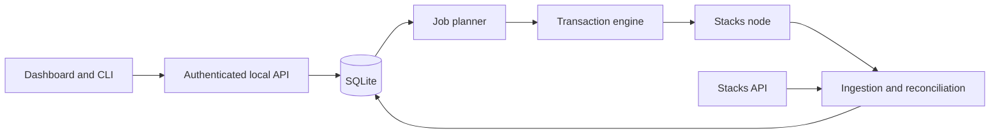

# Signer Sidekick V1 scope

This is the stable product and safety contract. It intentionally omits code-level schemas and
delivery status. See [issue #2](https://github.com/stx-labs/signer-sidekick/issues/2) for the live
roadmap and [the documentation index](../README.md) for implementation pointers.

## Product decision

Build a clean, self-hosted PoX-5 operator control plane instead of porting the PoX-4 transaction
loop from `degen-lab/stacker-flow-automation`.

PoX-5 makes the signer-manager the pool primitive. Stakers select it directly, positions may span
many cycles, and rewards require calculation, manager claims, staker payouts, and sometimes sBTC
withdrawals to Bitcoin L1. Sidekick therefore centers on reconciliation and safe permissionless
operations rather than recurring delegation commits.

## Scope

| Decision | V1 |
| --- | --- |
| Pool | STX-only |
| Deployment | One network and signer-manager per instance |
| Manager | Pinned upstream reference behavior |
| Existing setup | Attach without redeployment |
| New setup | Generate and verify manager and registration artifacts |
| Runtime authority | Dedicated low-balance gas payer for allowlisted permissionless calls |
| Manager admin | External and offline |
| Signer key | Remains on the signer host |
| Packaging | One OCI container, embedded UI, SQLite |
| License | GPL-3.0-only |

The product should answer:

1. Is the manager deployed, granted, registered, and eligible?
2. Which STX positions belong to it now and in upcoming cycles?
3. Which reward and withdrawal operations remain incomplete?
4. What action, if any, should the operator take?

### Explicitly out of scope

- Installing or controlling `stacks-node` or `stacks-signer`.
- Signer process, signing-performance, log, or host monitoring.
- End-user wallet connection, pool selection, or stake submission.
- PoX-4 migration tracking.
- sBTC bond pooling and bond-member operations.
- Multiple managers in one process.
- Automation for arbitrary custom manager contracts.
- Multi-user RBAC, tax reporting, or fiat accounting.

## Operator journeys

### Attach

The operator supplies the deployed manager and endpoints. Sidekick verifies the network, manager
source/interface, registration, signer grant, eligibility, and indexed history. Attach never
redeploys or changes the manager and always begins in Observe mode.

An unknown source may attach read-only when its network and interface are compatible. A
parameter-only render of the pinned reference source can be identified through an installed
profile, but Sidekick reproduces the source independently. ABI similarity is never an automation
gate.

### Fresh setup

Sidekick validates the connected network, renders a reviewable manager artifact, verifies public
signer-grant output, prepares `register-self` arguments, and confirms the resulting on-chain state.
The operator reviews, signs, and broadcasts deployment and admin calls using external tooling.

Node and signer setup remain upstream responsibilities. See the
[operator deployment guide](../operator/deployment.md).

### Normal operation

The dashboard summarizes registration, cycle timing, current and projected pool membership,
reward checkpoints, payout progress, withdrawals, and required actions. Large collections are
paginated and exportable.

Sidekick also generates static or live pool-information artifacts for the operator to host. It
does not expose a public pool route or collect staker inputs.

## Functional requirements

### Registration and pool state

- Verify manager source, signer registration, live grant, and revocation.
- Show current and next-cycle signer-set membership and threshold margin.
- Enumerate STX positions, changes, expiration, and deferred unlock state.
- Distinguish contract-authoritative state from indexed history and local projections.
- Detect unsupported bond positions without treating them as STX pool principal.

### Rewards and withdrawals

- Track both reward-calculation checkpoints and manager claims.
- Preserve the fee snapshot effective for each reward cycle.
- Track per-staker direct-sBTC and Bitcoin L1 payout state.
- Reconcile accepted-withdrawal settlement and rejected-withdrawal reclaim.
- Account for held funds separately from outstanding withdrawal liabilities.
- Treat permissionless races as reconciliation outcomes, not necessarily failures.

Admin-only fee changes, admin changes, deployment, registration, fee withdrawal, and fee-refund
sweeps remain external operations. Sidekick may explain and verify them but does not sign them.

### Application operations

- Resumable ingestion and reconciliation across restart and provider changes.
- Explicit freshness, source, disagreement, and degraded-state reporting.
- Alerts for registration, threshold, reward, withdrawal, gas, ingestion, and transaction risks.
- Health endpoints, metrics, structured redacted logs, backups, and support bundles.

## Trust and authority

Sidekick must never accept a signer key, manager-admin key, or mnemonic. Observe mode cannot
broadcast. Future automation uses only a dedicated gas payer and allowlisted permissionless calls.

Network compatibility and manager profile files are data, not authority:

- Network profiles identify live PoX-5 and sBTC deployments and may guide setup.
- Manager profiles identify a deployed source; reference claims are reproduced from pinned source.
- Neither file type can install executable behavior or authorize transaction automation.
- Public-network contradictions fail closed.

Before broadcasting ships, compatibility facts require authenticated attestations and an
independent security review. See
[ADR 0007](../architecture/decisions/0007-release-independent-network-compatibility.md) and
[issue #6](https://github.com/stx-labs/signer-sidekick/issues/6).

### Automation modes

| Mode | Behavior |
| --- | --- |
| Observe | Read, reconcile, display, and alert only |
| Assist | Build and simulate; require operator approval to broadcast |
| Automate | Broadcast separately enabled jobs within policy |

All deployments start in Observe. Network mismatch, source mismatch, stale authoritative data, or
repeated unexpected errors must prevent new broadcasts while already-submitted transactions remain
tracked.

## Data and architecture

The local node is authoritative for current actionable state and cycle boundaries. The Stacks API
provides enumeration, history, and transaction enrichment. SQLite is a projection and audit trail,
never the sole authority for a broadcast decision.

If the API is unavailable, Sidekick preserves node-derived current state and pauses work that needs
complete enumeration. If the node is unavailable or disagrees materially with the API, Sidekick
does not plan or broadcast state-changing work.

The default deployment is one container with one active worker and SQLite writer. Horizontal
scaling and Postgres are outside V1. See the ADRs for runtime, storage, auth, manager profiles, and
network compatibility.

## Automation design

The remaining V1 automation subsystem consists of:

1. A height-driven global reward-calculation watchdog.
2. Manager reward claims.
3. Per-staker payouts.
4. Withdrawal settlement and reclaim.

Each logical job needs a durable identity, explicit prerequisites, simulation, bounded fee policy,
transaction-attempt history, confirmation, and state reconciliation. Restarts, nonce conflicts,
replacement, reorgs, and another permissionless caller winning the race must not create duplicate
effects.

Protocol details that still require confirmation are maintained only in
[team questions](../reviews/team-questions.md).

## Acceptance

V1 is complete when all of the following hold:

### Setup and visibility

- Attach and Fresh setup work without Sidekick receiving an admin or signer key.
- Wrong network/source, revoked grant, unsupported bonds, and insufficient threshold are clear.
- Relevant manager history can be rebuilt and reconciled.
- Current and future STX membership, deadlines, rewards, and withdrawals are visible and exportable.
- The generated pool artifact contains only reviewed public information.

### Automation and safety

- One STX-only reward lifecycle runs unattended in an approved test environment.
- Restart, outage, replacement, permissionless race, and reorg cases are tested.
- No operation is successful until its intended state is reconciled.
- Data disagreement and policy violations stop unsafe broadcasts and alert the operator.
- All state changes are authenticated and auditable.

### Release

- External-node OCI/Compose deployment, migration, backup, and restore are tested.
- Security and supply-chain reviews are resolved.
- Source, SBOM, signed/checksummed images, provenance, and operator documentation are published.
- Mainnet rolls out Observe-first, then Assist and per-job Automate.

## Deferred

V1.x may add KMS/HSM providers, OIDC, additional enrollment adapters, or measured batch-claim
optimization. V2 may add signer-host health and sBTC bond pooling. Custom-manager automation
requires a separately reviewed, code-backed adapter.

## References

- [SIP-045](https://github.com/stacksgov/sips/blob/main/sips/sip-045/sip-045-pox-5-bitcoin-staking.md)
- [Contract provenance](../../contracts/PROVENANCE.md)
- [Architecture decisions](../architecture/decisions/)
- [Live roadmap](https://github.com/stx-labs/signer-sidekick/issues/2)
